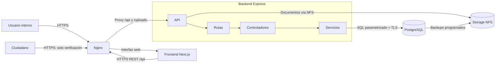
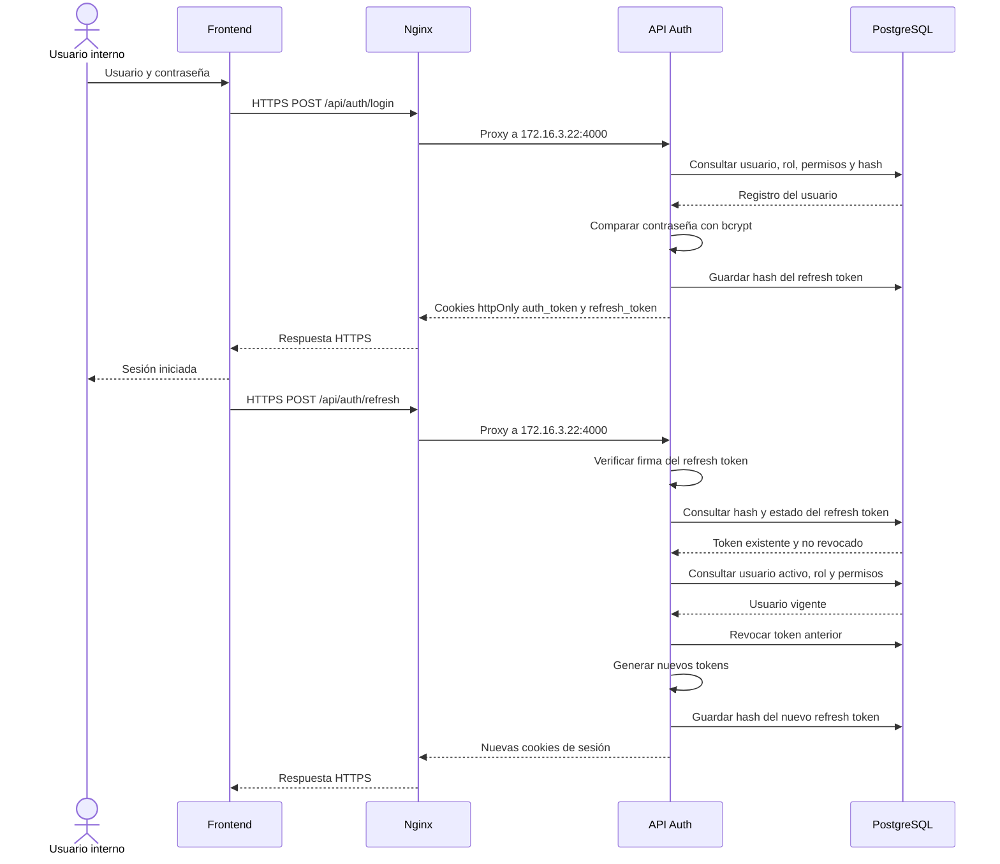
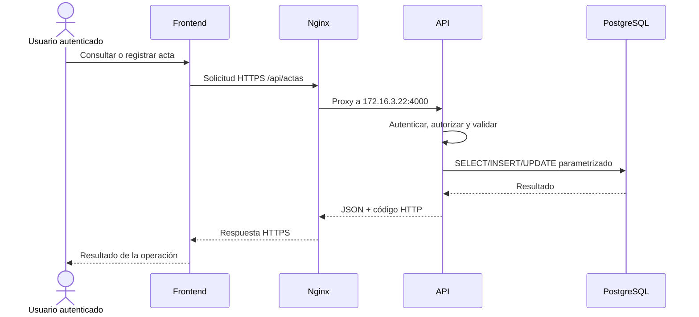
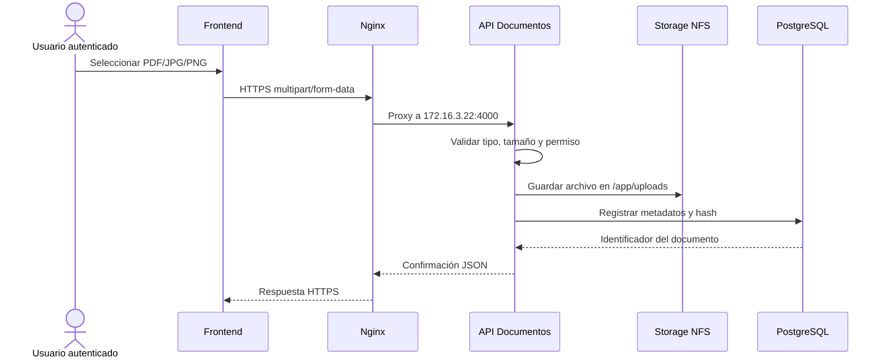
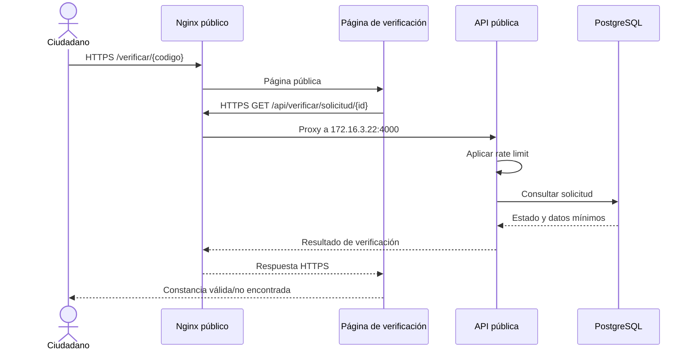
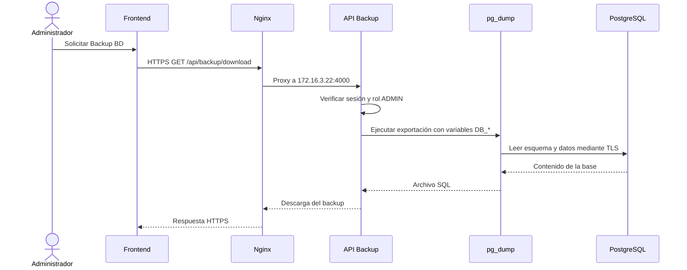
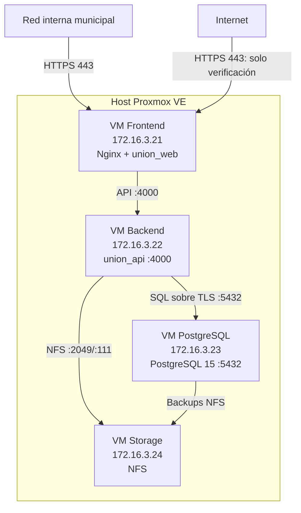
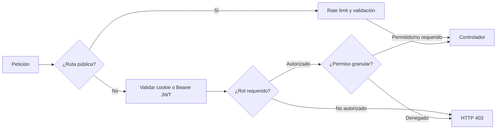
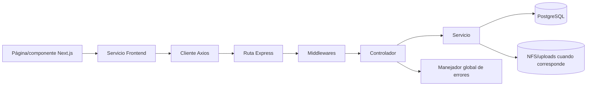
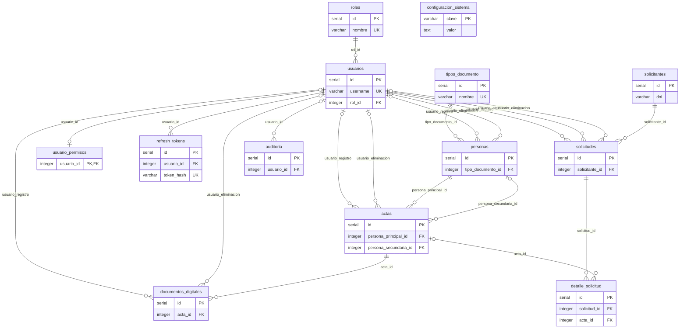

# MANUAL TÉCNICO
## Sistema de Registro Civil

**Municipalidad Distrital de La Unión Leticia — Tarma, Perú**

> **CONFIDENCIAL — USO INTERNO MUNICIPAL**
> Este documento contiene arquitectura, direcciones de red y credenciales operativas. Su distribución se limita al personal autorizado por la Municipalidad.

### Control documental

| Campo | Valor |
|---|---|
| Documento | Manual Técnico del Sistema de Registro Civil |
| Código documental | No proporcionado por la entidad |
| Entidad | Municipalidad Distrital de La Unión Leticia |
| Versión del manual | `1.0.0` |
| Fecha de edición | 23 de julio de 2026 |
| Estado | Versión final |
| Propietario del documento | No informado por la entidad |
| Aprobador | No informado por la entidad |
| Clasificación | Confidencial — Uso interno municipal |
| Repositorio técnico | `https://github.com/a1nthon1y/muni_union` |

### Historial de cambios

| Versión | Fecha | Descripción | Responsable |
|---|---|---|---|
| `1.0.0` | 23/07/2026 | Emisión inicial del Manual Técnico institucional | Equipo del proyecto |

### Lectores autorizados

Este manual está dirigido a:

- administradores de infraestructura y virtualización;
- personal de soporte y operaciones;
- desarrolladores responsables del mantenimiento;
- administradores de base de datos (DBA);
- responsables de seguridad digital y protección de datos;
- proveedores expresamente autorizados por la Municipalidad.

### Convenciones

| Término | Significado en este documento |
|---|---|
| Producción | Entorno municipal en operación, distribuido en cuatro máquinas virtuales |
| Red interna | Segmentos privados autorizados por Nginx (`172.16.0.0/16` y `192.168.0.0/16`) |
| Portal público | Superficie de Internet limitada a la verificación ciudadana |
| VM | Máquina virtual ejecutada en Proxmox VE |
| API | Interfaz REST del Backend bajo el prefijo `/api` |
| NFS | Sistema de archivos compartido por red para documentos y respaldos |
| PISP | Plataforma de Interoperabilidad del Estado Peruano |
| No verificado | Dato que requiere comprobación directa en la infraestructura |
| No implementado | Funcionalidad que no existe en el código ni en la configuración vigente |

### Contenido institucional

1. **Generalidades y Objetivos**
   - 1.1. Propósito del documento
   - 1.2. Alcance del software
2. **Arquitectura del Sistema y Plataforma Tecnológica**
   - 2.1. Vista de arquitectura
   - 2.2. Flujo de datos
   - 2.3. Tecnologías del Backend y Frontend
   - 2.4. Infraestructura, redes y servidores
3. **Descripción y Especificación de Módulos**
   - 3.1. Módulo de Seguridad y Control de Accesos
   - 3.2. Módulos principales del negocio
   - 3.3. Módulo de reportes y tareas programadas
   - 3.4. Módulo de auditoría
4. **Estructura y Gestión del Código Fuente**
   - 4.1. Enlace al repositorio institucional
   - 4.2. Árbol de directorios y organización del proyecto
   - 4.3. Estándares de codificación y buenas prácticas
5. **Requerimientos, Instalación y Despliegue**
   - 5.1. Requisitos mínimos de hardware y software
   - 5.2. Guía de instalación en producción
   - 5.3. Diccionario de variables de entorno
6. **Seguridad Digital**
   - 6.1. Mecanismos de autenticación
   - 6.2. Cifrado de datos en tránsito y en reposo
   - 6.3. Políticas de almacenamiento de logs y registros de error
7. **Interoperabilidad y Componentes Externos**
   - 7.1. Catálogo de APIs y endpoints
   - 7.2. Integración con la PISP, de corresponder
8. **Gestión de Base de Datos**
   - 8.1. Modelo Entidad–Relación
   - 8.2. Diccionario de datos
   - 8.3. Scripts de inicialización y protección de datos personales
9. **Soporte, Mantenimiento y Continuidad**
   - 9.1. Procedimientos de respaldo y restauración
   - 9.2. Matriz de errores comunes y acciones de solución

---

## 1. Generalidades y Objetivos

### 1.1. Propósito del documento

El presente Manual Técnico centraliza la información necesaria para comprender, administrar, desplegar, integrar, mantener y recuperar el Sistema de Registro Civil de la Municipalidad Distrital de La Unión Leticia.

Sus objetivos son:

1. describir la arquitectura y el flujo técnico de la información;
2. identificar la plataforma tecnológica y la infraestructura de producción;
3. documentar los módulos, controles de seguridad y modelo de datos;
4. establecer el procedimiento completo de instalación y despliegue;
5. proporcionar el catálogo de interfaces para integraciones municipales;
6. definir procedimientos de backup, restauración, mantenimiento y diagnóstico;
7. distinguir expresamente las capacidades implementadas de las no implementadas.

El documento constituye la referencia técnica principal del sistema. El Manual de Usuario se mantiene como documento independiente para la operación funcional.

### 1.2. Alcance del software

El sistema administra los procesos municipales relacionados con:

- registro y consulta de personas;
- actas de nacimiento, matrimonio y defunción;
- digitalización y asociación de documentos PDF, JPG y PNG;
- solicitudes de copias y constancias;
- importación masiva de información histórica;
- gestión de usuarios, roles y permisos;
- dashboard, reportes y exportaciones;
- auditoría de acciones;
- generación y descarga de backups;
- configuración de la URL de verificación;
- verificación ciudadana de solicitudes atendidas.

#### Límites del alcance

| Área | Estado |
|---|---|
| Aplicación administrativa completa | Implementada para la red interna municipal |
| API administrativa | Implementada para consumo interno autenticado |
| Verificación ciudadana | Implementada como única superficie prevista para acceso público |
| Integración PISP | No implementada actualmente |
| Consulta en línea a RENIEC o SUNARP | No implementada actualmente |
| Webhooks, colas de mensajería o ESB | No implementados actualmente |
| MFA, OAuth o API keys por integrador | No implementados actualmente |
| Cumplimiento legal automatizado de la Ley N.º 29733 | No implementado; requiere controles y procedimientos institucionales adicionales |

La denominación **CUI** presente en la numeración de actas no significa que exista una conexión en línea con RENIEC.

Este manual no sustituye las políticas, procedimientos ni responsabilidades institucionales de la Municipalidad.

---

## 2. Arquitectura del Sistema y Plataforma Tecnológica

### 2.1. Vista de arquitectura

El sistema utiliza una **arquitectura web monolítica en capas**, desplegada de forma distribuida en cuatro VMs. No es una arquitectura de microservicios.



#### Responsabilidad de las capas

| Capa | Responsabilidad |
|---|---|
| Nginx | Terminación HTTPS, separación entre sitio interno y portal público, proxy y límites de carga |
| Frontend | Interfaz de usuario, navegación, validaciones de presentación y consumo de la API |
| Rutas | Definición de endpoints, validaciones y middleware de autenticación/autorización |
| Controladores | Traducción de peticiones HTTP y respuestas |
| Servicios | Reglas de negocio, consultas parametrizadas y coordinación de persistencia |
| PostgreSQL | Persistencia relacional de usuarios, personas, actas, solicitudes, auditoría y configuración |
| NFS | Persistencia compartida de documentos y backups |

El volumen NFS `/mnt/logs:/app/logs` está provisionado en el Backend; sin embargo, el logger actual escribe a `stdout` y Docker conserva la salida con el driver `json-file`. Por ello, la centralización efectiva de logs en NFS se considera **no implementada actualmente**.

### 2.2. Flujo de datos

#### Inicio y renovación de sesión



El access token tiene una vigencia configurada de una hora y el refresh token de siete días. En producción, las cookies son `httpOnly`, `secure` y `sameSite=strict`.

#### Consulta o registro de actas



#### Digitalización documental



#### Verificación ciudadana



#### Generación de backup desde la aplicación



### 2.3. Tecnologías del Backend y Frontend

| Componente | Tecnología | Versión verificada | Fuente |
|---|---|---|---|
| Runtime Backend | Node.js | 20 | `back/Dockerfile` |
| Framework Backend | Express | `5.2.1` | `back/package.json` |
| Driver PostgreSQL | `pg` | `8.17.1` | `back/package.json` |
| Autenticación | JSON Web Token | `9.0.3` | `back/package.json` |
| Logs de aplicación | Pino | `10.3.1` | `back/package.json` |
| Documentación API | Swagger UI / OpenAPI | `swagger-ui-dist 5.32.3`, `swagger-ui-express 5.0.1`, `swagger-jsdoc 6.2.8` | `back/package-lock.json` |
| Runtime Frontend | Node.js | 20 | `front/Dockerfile` |
| Framework Frontend | Next.js | `16.1.6` | `front/package.json` |
| Librería UI | React / React DOM | `19.2.3` | `front/package.json` |
| Lenguaje Frontend | TypeScript | `5.x` | `front/package.json` |
| Estilos | Tailwind CSS | `4.x` | `front/package.json` |
| Estado cliente | Zustand | `5.0.11` | `front/package.json` |
| Base de datos | PostgreSQL | 15 | Scripts de despliegue |
| Contenedores | Docker / Docker Compose | Versión instalada no verificada | Infraestructura |
| Hipervisor | Proxmox VE | Versión instalada no verificada | Infraestructura |
| Sistema operativo VM | Debian GNU/Linux | Release instalada no verificada | Infraestructura |

Los scripts del repositorio fueron preparados para Debian 12. Las versiones instaladas de Proxmox, Docker, Docker Compose y Debian deberán comprobarse directamente con:

```bash
pveversion
docker --version
docker compose version
cat /etc/os-release
```

#### Swagger / OpenAPI

La interfaz Swagger existe en `/api/docs`, pero el código actual la habilita únicamente cuando `NODE_ENV` es distinto de `production`. Por tanto, no debe documentarse como disponible en producción hasta que exista una habilitación interna controlada.

### 2.4. Infraestructura, redes y servidores



| VM | Dirección | Servicio principal | Acceso previsto |
|---|---|---|---|
| Frontend | `172.16.3.21` | Nginx + `union_web` en `127.0.0.1:3000` | Usuarios internos; entrada al portal público restringido |
| Backend | `172.16.3.22` | `union_api` en `4000` | Nginx/Frontend y administración autorizada |
| PostgreSQL | `172.16.3.23` | PostgreSQL 15 en `5432` | Backend autorizado |
| Storage | `172.16.3.24` | NFS para uploads, backups y volumen de logs provisionado | Backend y PostgreSQL |

#### Direcciones de operación

| Uso | Dirección |
|---|---|
| Aplicación interna | `https://172.16.3.21` |
| API mediante Nginx | `https://172.16.3.21/api` |
| Health directo del Backend | `http://172.16.3.22:4000/api/health` — accesible desde la VM Frontend o localmente en Backend; UFW bloquea otros orígenes |
| Verificación ciudadana interna | `https://172.16.3.21/verificar` |
| Ejemplo de constancia | `https://172.16.3.21/verificar/000001` |
| Dominio público preparado, sujeto a DNS/certificado | `verificar.muniunion.gob.pe` |
| Código desplegado | `/opt/muni_union` |

#### Límites de exposición

- La aplicación administrativa, la API completa, los uploads y Swagger no deben publicarse libremente en Internet.
- El sitio público permite únicamente verificación ciudadana y los recursos indispensables para representarla.
- PostgreSQL y NFS no deben ser accesibles desde Internet.
- El Backend usa TLS hacia PostgreSQL cuando `DB_SSL=true`; actualmente el cliente configura `rejectUnauthorized: false`, por lo que el canal se cifra, pero no valida de forma fuerte la cadena e identidad del certificado del servidor.

#### Clasificación de configuraciones

| Artefacto | Clasificación | Uso |
|---|---|---|
| `deploy/docker-compose.backend.yml` | Producción vigente | VM Backend `.22` |
| `deploy/docker-compose.frontend.yml` | Producción vigente | VM Frontend `.21` |
| `deploy/frontend/04_setup_frontend.sh` | Producción vigente | Nginx del host `.21` |
| `docker-compose.yml` del directorio raíz | Desarrollo/local | Stack integrado fuera de la arquitectura 4-VM |
| `deploy/app/nginx-production.conf` | Legacy/no usar en 4-VM | Contiene upstream y límites distintos de producción |
| `nginx/nginx.conf` | Desarrollo/local | Proxy del stack integrado |

#### Dependencias y orden operativo

El orden de encendido es:

1. Storage `.24`.
2. PostgreSQL `.23`.
3. Backend `.22`.
4. Frontend `.21`.

El apagado planificado se realiza en orden inverso.

---

## 3. Descripción y Especificación de Módulos

### 3.1. Módulo de Seguridad y Control de Accesos

El módulo de seguridad protege la aplicación interna mediante autenticación, sesiones firmadas, roles y permisos granulares. La verificación ciudadana constituye una excepción pública controlada y no concede acceso a funciones administrativas.

#### Componentes de seguridad

| Componente | Implementación actual | Persistencia o configuración |
|---|---|---|
| Inicio de sesión | Usuario y contraseña; comparación con hash bcrypt | Tabla `usuarios` |
| Sesión de acceso | JWT con vigencia de una hora en cookie `auth_token` | `JWT_SECRET` |
| Renovación | Refresh token con vigencia de siete días; rotación y revocación | Tabla `refresh_tokens` y `REFRESH_TOKEN_SECRET` |
| Cookies | `httpOnly`; en producción: `secure` y `sameSite=strict` | Backend |
| Roles | `ADMIN` (`rol_id=1`) y `USER` (`rol_id=2`) | Tablas `roles` y `usuarios` |
| Permisos granulares | Modificar, anular o eliminar actas; modificar o eliminar personas | Tabla `usuario_permisos` |
| Limitación de solicitudes | Login 10/15 min; refresh 30/15 min; verificación 20/min por IP | Memoria del proceso Backend |
| Auditoría | Registro automático de escrituras y registro manual de login/logout | Tabla `auditoria` |

#### Actores y responsabilidades

| Actor | Capacidades principales |
|---|---|
| Administrador (`ADMIN`) | Gestión de usuarios y permisos, auditoría, backup, configuración, importación y funciones operativas |
| Operador (`USER`) | Personas, actas, digitalización, solicitudes, dashboard y reportes permitidos |
| Ciudadano | Consulta de verificación sin autenticación, limitada a los datos mínimos de la constancia |

#### Flujo de autorización



La API constituye la última barrera de autorización. Ocultar una opción en el Frontend mejora la experiencia, pero no sustituye los controles del Backend.

#### Limitaciones verificadas

- Los límites de solicitudes se almacenan en memoria; las dependencias Redis están instaladas, pero no se utilizan.
- La página de importación exige rol administrador en la API, aunque el botón **IMPORTAR** puede mostrarse a un operador.
- `AuthGuard` restringe expresamente Usuarios y Auditoría; Backup y Configuración se ocultan en el menú, mientras la API aplica la autorización definitiva.
- El cambio de contraseña propio existe en la API, pero no dispone actualmente de una pantalla equivalente en el menú de usuario.

### 3.2. Módulos principales del negocio

#### Matriz de trazabilidad funcional

| Módulo | Actores | Entradas | Procesamiento | Salidas | API principal | Datos relacionados |
|---|---|---|---|---|---|---|
| Dashboard | ADMIN, USER | Sesión y rango implícito de consulta | Agregación de conteos y evolución | Indicadores y gráficos | `/api/reportes` | `actas`, `personas`, `solicitudes`, `usuarios` |
| Personas | ADMIN, USER | DNI/documento, nombres y datos personales | Búsqueda, validación de duplicados, alta, edición, baja lógica y reactivación | Ficha de persona y listados paginados | `/api/personas` | `personas`, `tipos_documento` |
| Actas | ADMIN; USER para crear/consultar y, según `usuario_permisos`, modificar, anular o eliminar; reactivación exclusiva de ADMIN | Tipo, número, libro, año, fechas y personas vinculadas | Numeración, filtros, registro, edición, anulación, reactivación y eliminación lógica; al eliminar, documentos asociados se eliminan física y lógicamente | Acta y resultados de búsqueda/exportación | `/api/actas` | `actas`, `personas`, `documentos_digitales`; NFS uploads |
| Digitalización | ADMIN, USER; permisos de personas/actas aplican según operación | Datos de persona/cónyuge, tipo y numeración de acta, `acta_id` y archivo PDF/JPG/PNG | Busca/crea/actualiza personas, obtiene numeración, crea/actualiza acta, valida archivo de 20 MB, reemplaza adjunto y registra asociación | Persona(s), acta y documento digital vinculados | `/api/personas`, `/api/actas`, `/api/documentos` | `personas`, `tipos_documento`, `actas`, `documentos_digitales`; NFS uploads |
| Solicitudes | ADMIN, USER | Solicitante, actas solicitadas, pago y estado | Registro, atención, anulación, detalle y eliminación lógica de solicitud/detalles | Solicitud, constancia e impresión | `/api/solicitudes` | `solicitantes`, `solicitudes`, `detalle_solicitud`, `actas` |
| Usuarios | ADMIN; contraseña propia para autenticados | Identidad, rol, estado y permisos | Alta, modificación, activación, eliminación lógica, permisos y cambio de contraseña | Cuenta y permisos efectivos | `/api/usuarios` | `usuarios`, `roles`, `usuario_permisos`, `refresh_tokens` |
| Importación masiva | ADMIN | Excel `excel` y ZIP opcional `zip` | Validación y carga de hasta 30 000 filas; asociación de documentos | Resumen por fila y archivos importados | `/api/importacion` | `personas`, `actas`, `documentos_digitales`; NFS uploads |
| Verificación pública | Ciudadano | Código/ID de solicitud | Rate limit y consulta de datos mínimos | Estado y constancia verificable | `/api/verificar` | `solicitudes`, `solicitantes`, `detalle_solicitud`, `usuarios` |
| Configuración | Lectura autenticada; modificación ADMIN | URL pública de verificación | Validación y persistencia clave/valor | URL aplicada a nuevas constancias | `/api/configuracion` | `configuracion_sistema` |
| Backup BD | ADMIN | Sesión autorizada y variables `DB_*` | `pg_dump`: esquema y datos; fallback Node.js: solo sentencias `INSERT` | Archivo SQL descargable | `/api/backup` | Esquema `public` completo con `pg_dump`; datos restaurables tras migraciones en fallback |

#### Dashboard

Presenta un resumen operativo, evolución de actas y distribución de solicitudes por estado. Los reportes se calculan bajo demanda; no mantienen una tabla de estadísticas separada.

#### Personas

Centraliza la identificación de ciudadanos y soporta búsqueda por el parámetro `termino`, detección de duplicados, edición y baja lógica. La reactivación se restringe al administrador.

#### Actas

Gestiona actas de nacimiento, matrimonio y defunción. Incluye numeración clásica/CUI, filtros exactos por código, folio y libro, y controles granulares para modificar, anular o eliminar.

#### Digitalización y documentos

La pantalla de Digitalización implementa un flujo compuesto: busca o registra personas y cónyuges, obtiene la siguiente numeración, crea o actualiza el acta y finalmente asocia el documento. Para ello consume `/api/personas`, `/api/actas` y `/api/documentos`.

La operación documental recibe `acta_id` y el campo multipart `archivo`. El Backend admite PDF, JPG y PNG de hasta 20 MB, guarda el archivo bajo el volumen de uploads y registra metadatos en PostgreSQL. Al reemplazar un documento se elimina el archivo físico anterior y su registro queda marcado como eliminado. Cualquier usuario autenticado puede cargar o eliminar documentos; no existe un permiso granular específico para el archivo. Los documentos se sirven mediante `/uploads`, con Nginx como punto de entrada en producción.

#### Solicitudes

Gestiona al solicitante, el detalle de actas requeridas, pago, atención, anulación e impresión. Las solicitudes atendidas pueden consultarse mediante el portal público de verificación.

#### Usuarios

Permite al administrador crear cuentas, asignar roles, activar/desactivar usuarios y establecer permisos granulares. La API incluye cambio de contraseña del usuario autenticado y cierre de todas sus sesiones.

#### Importación masiva

Recibe un Excel y, opcionalmente, un ZIP. La API limita la carga a 500 MB y el servicio procesa como máximo 30 000 filas. Es una función administrativa aunque la entrada visual actual no verifica el rol antes de mostrar el botón.

#### Verificación pública

Es la única función diseñada para acceso ciudadano desde Internet. Devuelve datos mínimos de la solicitud y aplica un límite de 20 solicitudes por minuto por IP.

#### Configuración

Administra la URL base incluida en constancias. La consulta requiere sesión y la modificación exige rol administrador.

#### Backup BD

Genera una copia SQL usando la conexión configurada en `DB_*`. Con `pg_dump` incluye esquema y datos de `public`. Si `pg_dump` no está disponible, el fallback Node.js exporta únicamente datos mediante sentencias `INSERT`; antes de restaurarlo deben aplicarse las migraciones. La descarga es manual y exclusiva del administrador.

### 3.3. Módulo de reportes y tareas programadas

#### Reportes bajo demanda

| Reporte | Entrada y procesamiento | Salida | Acceso | Datos |
|---|---|---|---|---|
| `GET /api/reportes/resumen` | Sin filtros; agrega totales operativos | JSON de indicadores | Autenticado | `actas`, `personas`, `solicitudes`, `usuarios` |
| `GET /api/reportes/actas-evolucion` | Ventana fija de los últimos seis meses; agrupa actas por mes | JSON para gráfico temporal | Autenticado | `actas` |
| `GET /api/reportes/solicitudes-estados` | Agrupa solicitudes por estado | JSON de cantidades por estado | Autenticado | `solicitudes` |
| `GET /api/reportes/ingresos` | Últimos seis meses; solicitudes `ATENDIDO`; suma `detalle_solicitud.total` | JSON mensual de ingresos; consumo Frontend no verificado | ADMIN | `solicitudes`, `detalle_solicitud` |
| `GET /api/reportes/export/actas` | Aplica filtros recibidos en query | Archivo XLSX | Autenticado | `actas`, `personas`, `documentos_digitales` |
| `GET /api/reportes/export/personas` | Aplica filtros recibidos en query | Archivo XLSX | Autenticado | `personas`, `tipos_documento` |
| `GET /api/reportes/export/solicitudes` | Aplica filtros recibidos en query | Archivo XLSX | Autenticado | `solicitudes`, `solicitantes`, `usuarios` |
| `GET /api/reportes/export/auditoria` | Aplica filtros recibidos en query | Archivo XLSX | ADMIN | `auditoria`, `usuarios` |

#### Tareas programadas verificadas

| Tarea | Frecuencia | Componente | Resultado |
|---|---|---|---|
| Purga de refresh tokens expirados | Al iniciar Backend y cada 6 horas | `server.js` | Elimina sesiones vencidas |
| Purga de auditoría antigua | Al iniciar Backend y cada 6 horas | `server.js` | Aplica `AUDIT_RETENTION_DAYS`; valor por defecto 730 días |
| Backup PostgreSQL a NFS | Diario a las 02:00 | VM PostgreSQL | Genera `.sql.gz` y aplica rotación diaria/semanal/mensual |
| Revisión de disco Storage | `cron.daily` | VM Storage | Registra un aviso local en `/var/log/muni-disk-alert.log` sobre 85 % y elimina logs NFS mayores de 30 días |
| Backup Docker de desarrollo | Ejemplo diario a las 02:00 | Entorno local | Copia del contenedor `union_db`; no corresponde al despliegue 4-VM |

La descarga de backup desde la aplicación es manual y no constituye una tarea programada.

### 3.4. Módulo de auditoría

La auditoría registra las acciones que modifican información y determinados eventos de seguridad.

#### Datos registrados

| Campo | Finalidad |
|---|---|
| `id` | Identificador único del evento |
| `usuario_id` | Identificar al usuario responsable |
| `tabla_afectada` | Identificar el recurso de negocio |
| `operacion` | Clasificar la acción realizada |
| `registro_id` | Vincular la acción con el registro afectado |
| `descripcion` | Resumen técnico de la operación |
| `ip` | Dirección de origen observada por la API |
| `fecha` | Fecha y hora del evento |

#### Registro automático y manual

- El middleware automático registra peticiones autenticadas `POST`, `PUT`, `PATCH` y `DELETE` con respuesta inferior a 400.
- Las consultas `GET` no se registran automáticamente.
- Login, logout, cierre de todas las sesiones e importaciones generan entradas explícitas desde sus controladores.
- Los controladores pueden marcar una acción como ya auditada para evitar duplicados.

#### Consulta, acceso y retención

- La consulta de auditoría y su exportación se restringen al administrador.
- Los filtros admiten usuario, tabla, operación, fechas y paginación.
- `AUDIT_RETENTION_DAYS` define la retención; si no se configura, el servicio utiliza 730 días.
- La purga se ejecuta al iniciar el Backend y luego cada seis horas.
- La Municipalidad debe aprobar la retención definitiva conforme a su política y obligaciones sobre datos personales.

---

## 4. Estructura y Gestión del Código Fuente

### 4.1. Enlace al repositorio institucional

El repositorio utilizado para el proyecto es:

```text
https://github.com/a1nthon1y/muni_union
```

La titularidad institucional de la cuenta GitHub no ha sido acreditada en la documentación disponible. Antes de la entrega definitiva, la Municipalidad debe confirmar el propietario, los administradores autorizados, la política de ramas y el mecanismo de respaldo del repositorio.

El código desplegado en las VMs se ubica en:

```text
/opt/muni_union
```

### 4.2. Árbol de directorios y organización del proyecto

```text
muni_union/
├── back/
│   ├── src/
│   │   ├── config/          Configuración de BD, logger y Swagger
│   │   ├── controllers/     Adaptación HTTP y coordinación
│   │   ├── middlewares/     Auth, roles, permisos, auditoría, uploads y errores
│   │   ├── migrations/      Scripts SQL 000–006
│   │   ├── routes/          Endpoints y validación
│   │   ├── services/        Reglas de negocio y consultas SQL
│   │   ├── utils/           Utilidades compartidas
│   │   ├── app.js           Ensamblaje de Express
│   │   └── server.js        Inicio y tareas periódicas
│   ├── test/                Pruebas Node
│   ├── Dockerfile
│   └── package.json
├── front/
│   ├── src/
│   │   ├── app/             Rutas Next.js: dashboard, login, verificar e imprimir
│   │   ├── components/      Componentes funcionales y de interfaz
│   │   ├── hooks/           Hooks React
│   │   ├── lib/             Utilidades de presentación
│   │   ├── services/        Clientes de API por dominio
│   │   ├── store/           Estado de autenticación
│   │   ├── types/           Tipos TypeScript
│   │   └── utils/           Axios, refresh y utilidades
│   ├── public/templates/    Plantilla de importación
│   ├── Dockerfile
│   └── package.json
├── deploy/
│   ├── backend/             Preparación de VM Backend
│   ├── db/                  PostgreSQL, migraciones y restauración
│   ├── frontend/            Nginx y VM Frontend
│   ├── storage/             NFS y tareas de disco
│   ├── docker-compose.backend.yml
│   ├── docker-compose.frontend.yml
│   └── deploy.sh
├── nginx/                   Configuración del entorno integrado/local
├── scripts/                 Utilidades del entorno de desarrollo
├── docs/                    Planes y documentación de trabajo
├── docker-compose.yml       Stack de desarrollo/local
├── MANUAL_TECNICO.md
└── MANUAL_USUARIO.md
```

#### Patrón de organización



El Backend sigue predominantemente el flujo `ruta → middleware → controlador → servicio → PostgreSQL`. No existe una capa independiente de repositorios ni un modelo de entidades/agregados propio de DDD o Clean Architecture. Las consultas SQL residen principalmente en los servicios.

Existen excepciones verificadas: los controladores de backup, verificación y documentos realizan parte de su acceso a PostgreSQL directamente. Estas excepciones deben considerarse al mantener o refactorizar el sistema.

### 4.3. Estándares de codificación y buenas prácticas

#### Prácticas verificadas

| Práctica | Estado y evidencia |
|---|---|
| Módulos Backend | ES Modules mediante `"type": "module"` |
| Frontend tipado | TypeScript y componentes `.tsx` |
| Consultas SQL | Parámetros posicionales en servicios para reducir inyección SQL |
| Validación | `express-validator` se aplica parcialmente; no todas las mutaciones tienen validación declarativa de ruta |
| Autenticación | Cookies `httpOnly`, JWT y refresh tokens revocables |
| Manejo de errores | Middleware global y traducción de errores PostgreSQL |
| Eliminación lógica | Aplicada en recursos de negocio que requieren conservación |
| Logging | Pino a stdout y rotación Docker `json-file` |
| Lint Frontend | ESLint 9 y configuración Next.js |
| Pruebas Backend | `node --test` para filtros de actas y configuración de backup |
| Verificación sintáctica Backend | Script `build-check.js` con comprobación de archivos JavaScript |

#### Flujo recomendado para cambios

1. Crear una rama de trabajo a partir de `main`.
2. Mantener el cambio dentro de la capa responsable.
3. Ejecutar validaciones y pruebas locales.
4. Revisar que no se versionen archivos `.env`, credenciales adicionales, uploads o backups.
5. Solicitar revisión técnica.
6. Integrar mediante un commit identificable y desplegar siguiendo la sección 5.

#### Comandos de control existentes

```bash
# Frontend
cd front
npm run lint
npm run build

# Backend
cd back
npm run build
npm test
```

#### Limitaciones de calidad verificadas

| Limitación | Estado actual |
|---|---|
| Lint Backend | No existe script/configuración ESLint específica |
| Formato automático unificado | No implementado |
| CI principal | No existe workflow activo en `.github/workflows/`; hay un workflow Deno ubicado bajo `back/.github/workflows/`, configurado para `master` y no representativo del stack Node/Next |
| Pruebas Backend | Cobertura limitada a dos archivos de prueba |
| Pruebas Frontend | No se identificó suite automatizada |
| Rate limit distribuido | Redis está declarado como dependencia, pero no se utiliza |
| Protección de rutas Frontend | No todas las rutas administrativas aparecen en la matriz de `AuthGuard`; la API aplica el control definitivo |

Estas limitaciones deben tratarse como deuda técnica y no como capacidades existentes.

---

## 5. Requerimientos, Instalación y Despliegue

### 5.1. Requisitos mínimos de hardware y software

#### Dimensionamiento de la plataforma

El repositorio define límites de 1 GiB para el contenedor Frontend, 2 GiB para el Backend y una configuración PostgreSQL ajustada para una VM de 4 GiB. La siguiente capacidad es una **recomendación operativa**, no una medición automática del software:

| Componente | Capacidad base recomendada | Observación |
|---|---|---|
| Host Proxmox VE | 16 GiB RAM como mínimo operativo | Reservar entre 1.5 y 2 GiB para Proxmox |
| Host con VM Windows auxiliar | 24–32 GiB RAM | La VM Windows debe apagarse cuando no se utilice |
| VM Frontend `.21` | 2 vCPU, 2 GiB RAM | El contenedor limita su uso a 1 GiB |
| VM Backend `.22` | 2 vCPU, 2–3 GiB RAM | El contenedor limita su uso a 2 GiB; importaciones elevan consumo |
| VM PostgreSQL `.23` | 2 vCPU, 4 GiB RAM | El script configura `shared_buffers=1GB` y `effective_cache_size=3GB` |
| VM Storage `.24` | 1–2 vCPU, 1–2 GiB RAM | El disco debe dimensionarse por uploads, logs y retención de backups |

Cada VM debe contar con NIC virtual de al menos 1 Gbit/s dentro de la LAN. El almacenamiento mínimo no puede fijarse únicamente desde el repositorio: las imágenes, base y documentos reales no están inventariados aquí. Frontend y Backend deben cubrir Debian, imágenes Docker, dos builds simultáneos y 30 % libre; PostgreSQL debe cubrir tres veces el tamaño proyectado de la base y 30 % libre; Storage debe cubrir uploads proyectados más todas las copias de retención y 20 % libre. El responsable debe registrar los valores resultantes antes de aprobar capacidad.

#### Incidente operativo de memoria confirmado

El 22 y 23 de julio de 2026, un host con 7.6 GiB de RAM ejecutó cinco VMs configuradas con aproximadamente 4 GiB cada una. El kernel del host activó el **OOM Killer** y terminó los procesos KVM de las VMs 103 (Backend) y 105 (Storage). El error `apt-get update` observado en el historial no produjo los apagados.

Condiciones observadas:

- 7.4 GiB de 7.6 GiB utilizados;
- 222 MiB disponibles;
- 5.2 GiB de swap utilizados;
- cinco VMs encendidas con más memoria configurada que la capacidad física.

Fuente de evidencia: salida de `journalctl` y `free -h` proporcionada por el administrador el 23/07/2026. El host registró `Out of memory: Killed process ... kvm` para `103.scope` el 22/07/2026 a las 23:21 y para `105.scope` el 23/07/2026 a las 00:46.

No se debe operar nuevamente con esa sobreasignación. Antes de encender una VM auxiliar se verifican `free -h`, `swapon --show` y la suma de memoria de `qm list`.

#### Software requerido

| Elemento | Requisito |
|---|---|
| Hipervisor | Proxmox VE; versión instalada no verificada |
| VMs | Debian GNU/Linux; scripts preparados para Debian 12 |
| Contenedores | Docker CE y plugin Docker Compose |
| Frontend | Node.js 20, Next.js 16.1.6 |
| Backend | Node.js 20, Express 5.2.1 |
| Base de datos | PostgreSQL 15; `pg_trgm` requerida; `unaccent` opcional y no utilizada por la aplicación |
| Proxy | Nginx en el sistema operativo de la VM Frontend |
| Almacenamiento | NFS Kernel Server en la VM Storage |
| Cliente técnico | SSH, `curl`, `psql`, `showmount` y navegador moderno |

#### Prerrequisitos de red y acceso

Antes de ejecutar los scripts se debe contar con:

1. las IPs `172.16.3.21–24` reservadas y configuradas de forma estática;
2. gateway, DNS y NTP proporcionados por la red municipal;
3. acceso saliente temporal a repositorios Debian, Docker, PostgreSQL y GitHub;
4. una estación técnica dentro de `172.16.3.0/24`;
5. acceso inicial `root` para endurecer cada VM;
6. contraseña y/o llave SSH para el usuario `deploy`;
7. acceso al repositorio `https://github.com/a1nthon1y/muni_union`;
8. decisión institucional sobre DNS y certificado de `verificar.muniunion.gob.pe`.

Gateway, DNS, versión instalada de Proxmox y capacidad definitiva de disco deben verificarse directamente en la infraestructura; no están definidos en el repositorio.

#### Puertos de producción

| Origen | Destino | Puerto | Uso | Restricción |
|---|---|---:|---|---|
| Red municipal | Todas las VMs | 22/TCP | SSH | Solo `172.16.3.0/24` |
| Usuarios | Frontend `.21` | 80/TCP | Redirección a HTTPS | Según firewall perimetral |
| Usuarios | Frontend `.21` | 443/TCP | Aplicación/verificación | Nginx separa zona interna y pública |
| Frontend `.21` | Backend `.22` | 4000/TCP | API | UFW permite únicamente `.21` |
| Backend `.22` | PostgreSQL `.23` | 5432/TCP | SQL sobre TLS | UFW y `pg_hba.conf` permiten únicamente `.22` |
| Backend `.22` | Storage `.24` | 111 y 2049/TCP | NFS uploads/logs | Configuración vigente, potencialmente insuficiente por RPC dinámico |
| PostgreSQL `.23` | Storage `.24` | 111 y 2049/TCP | NFS backups | Configuración vigente, potencialmente insuficiente por RPC dinámico |
| Host Frontend | Contenedor Frontend | 3000/TCP | Next.js | Vinculado a `127.0.0.1` |

### 5.2. Guía de instalación en producción

#### Convención de ejecución

Cada comando identifica el equipo donde se ejecuta:

- `[OPERADOR]`: estación del técnico.
- `[PVE]`: host Proxmox.
- `[VM21]`: Frontend.
- `[VM22]`: Backend.
- `[VM23]`: PostgreSQL.
- `[VM24]`: Storage.

Los scripts `00` a `04` requieren privilegios `root`. Después del endurecimiento, el acceso remoto normal se realiza con `deploy` y `sudo`.

#### Paso 0 — Crear y comprobar las VMs

En Proxmox se crean cuatro VMs con las IPs definidas en la sección 2.4. Antes de instalar:

```bash
# [PVE]
qm list
free -h
swapon --show
```

No se continúa si la memoria comprometida supera la capacidad segura del host.

#### Paso 1 — Endurecimiento base de todas las VMs

Repetir para `.21`, `.22`, `.23` y `.24`:

```bash
# [OPERADOR]
scp deploy/00_base_hardening.sh root@172.16.3.XX:/tmp/
ssh root@172.16.3.XX "bash /tmp/00_base_hardening.sh"
```

El script:

- actualiza Debian;
- instala UFW, Fail2ban y herramientas esenciales;
- crea `deploy` con `sudo`;
- desactiva el login SSH de `root`;
- limita SSH a `172.16.3.0/24`;
- activa endurecimiento básico del kernel.

**Control obligatorio:** no cerrar la sesión inicial de `root` hasta establecer la contraseña o llave de `deploy`, instalar Git en las VMs que alojarán el repositorio y comprobar un segundo acceso:

```bash
# [VMXX, dentro de la sesión root existente]
passwd deploy

# [OPERADOR, nueva terminal]
ssh deploy@172.16.3.XX
sudo -v

# [VM21, VM22 y VM23]
sudo apt install -y git
command -v git
```

Credenciales actuales informadas para las cuatro VMs:

| Usuario | Contraseña | Acceso previsto |
|---|---|---|
| `deploy` | `1234567` | SSH desde la LAN en `.21`, `.22`, `.23` y `.24` |
| `root` | `123456` | Consola local/Proxmox; SSH queda deshabilitado por el hardening |

Estas contraseñas son débiles y compartidas. Deben cambiarse antes de la puesta en producción, registrar valores diferentes por VM en la bóveda institucional y privilegiar llaves SSH para `deploy`.

#### Paso 2 — Storage NFS `.24`

```bash
# [OPERADOR]
scp deploy/storage/01_setup_storage.sh deploy@172.16.3.24:/tmp/
ssh deploy@172.16.3.24 "sudo bash /tmp/01_setup_storage.sh"

# [VM24]
sudo exportfs -v
```

Exports esperados:

| Export | Cliente autorizado | Uso |
|---|---|---|
| `/srv/muni/uploads` | Backend `.22` | Documentos digitalizados |
| `/srv/muni/backups` | PostgreSQL `.23` | Backups diarios/semanales/mensuales |
| `/srv/muni/logs` | Backend `.22` | Volumen provisionado; logger centralizado no implementado |

El script vigente exporta con `no_root_squash` y abre TCP 111/2049. Esta configuración aumenta el impacto de un cliente comprometido y puede ser insuficiente para herramientas RPC como `showmount` si `mountd` usa puertos dinámicos. La aceptación se basa en una prueba real de montaje/escritura. Como endurecimiento posterior se recomienda migrar a NFSv4.2 sobre 2049/TCP y `root_squash`, después de validar permisos del contenedor.

#### Paso 3 — PostgreSQL `.23`

Antes de ejecutar el script, generar el locale requerido y editar una copia controlada:

```bash
# [VM23]
sudo apt install -y locales
sudo sed -i '/^# *es_PE.UTF-8 UTF-8/s/^# *//' /etc/locale.gen
sudo locale-gen es_PE.UTF-8
locale -a | grep -i '^es_PE\.utf8$'
```

```text
DB_NAME="registro_muni_union"
DB_APP_USER="app_user"
DB_APP_PASS="muniunion2026_prod"
```

El archivo versionado conserva un marcador y no debe ejecutarse sin reemplazarlo.

```bash
# [OPERADOR]
scp deploy/db/02_setup_postgresql.sh deploy@172.16.3.23:/tmp/
ssh deploy@172.16.3.23 "sudo bash /tmp/02_setup_postgresql.sh"
```

El script instala PostgreSQL 15, TLS autofirmado, `pg_hba.conf`, el usuario de aplicación, la base y el cron de backup NFS. No se continúa si el comando de locale anterior no devuelve `es_PE.utf8`.

#### Paso 4 — Inicialización canónica del esquema

La secuencia oficial es:

1. `000_schema.sql`
2. `001_refresh_tokens.sql`
3. `002_indexes.sql`
4. `003_usuario_permisos.sql`
5. `004_usuario_permisos_modificar.sql`
6. `005_seed_data.sql`
7. `006_configuracion_sistema.sql`

Preparar el repositorio:

```bash
# [VM23]
sudo mkdir -p /opt/muni_union
sudo chown deploy:deploy /opt/muni_union
git clone https://github.com/a1nthon1y/muni_union.git /opt/muni_union
```

Aplicar como `app_user` mediante socket local:

```bash
# [VM23]
export PGPASSWORD='muniunion2026_prod'
for archivo in /opt/muni_union/back/src/migrations/00{0..6}_*.sql; do
  psql -U app_user -d registro_muni_union -v ON_ERROR_STOP=1 -f "$archivo"
done
unset PGPASSWORD
```

El patrón `00{0..6}_*.sql` debe resolver exactamente siete archivos. Revisar la lista antes de ejecutar:

```bash
# [VM23]
ls -1 /opt/muni_union/back/src/migrations/00{0..6}_*.sql
```

##### Alternativa destructiva `init_db.sh limpia`

`init_db.sh limpia` elimina la base completa, termina conexiones y recrea los datos iniciales. Solo se utiliza en una instalación nueva o después de un backup validado. Exige escribir `SI BORRAR TODO`.

`instalacion_limpia.sql` no contiene actualmente la tabla `configuracion_sistema`; después del modo limpio se debe aplicar `006_configuracion_sistema.sql` y verificarlo. Los comentarios `Muni2025*` dentro del SQL consolidado son inconsistentes con el hash y mensaje final; la credencial bootstrap verificada es `aespinoza` / `123456`.

```bash
# [VM23] — DESTRUCTIVO
cd /opt/muni_union
bash deploy/db/init_db.sh limpia

# Obligatorio después del modo limpia
export PGPASSWORD='muniunion2026_prod'
psql -U app_user -d registro_muni_union -v ON_ERROR_STOP=1 \
  -f back/src/migrations/006_configuracion_sistema.sql
unset PGPASSWORD
```

##### Verificación del esquema

```bash
# [VM23]
sudo -u postgres psql -d registro_muni_union -c \
  "SELECT COUNT(*) AS tablas FROM information_schema.tables WHERE table_schema='public' AND table_type='BASE TABLE';"
sudo -u postgres psql -d registro_muni_union -c \
  "SELECT clave, valor FROM configuracion_sistema;"
sudo -u postgres psql -d registro_muni_union -c \
  "SELECT username, activo, rol_id FROM usuarios WHERE username='aespinoza';"
```

Resultado esperado: 13 tablas, `url_verificacion_publica = https://172.16.3.21` y una fila `aespinoza` activa con `rol_id=1`.

#### Paso 5 — Backend `.22`

```bash
# [OPERADOR]
scp deploy/backend/03_setup_backend.sh deploy@172.16.3.22:/tmp/
ssh deploy@172.16.3.22 "sudo bash /tmp/03_setup_backend.sh"

# [VM22]
git clone https://github.com/a1nthon1y/muni_union.git /opt/muni_union
sudo cp /root/muni_union.env.backend /opt/muni_union/.env.backend
sudo chown deploy:deploy /opt/muni_union/.env.backend
sudo chmod 600 /opt/muni_union/.env.backend
```

Editar `/opt/muni_union/.env.backend` con los valores de la sección 5.3. No copiar `back/.env`: corresponde al desarrollo local y contiene una conexión distinta.

```bash
# [VM22]
cd /opt/muni_union
docker compose -f deploy/docker-compose.backend.yml up -d --build
docker ps --filter name=union_api
curl -f http://172.16.3.22:4000/api/health
```

Esperado: contenedor `union_api` saludable, `status=ok` y `services.db=ok`.

#### Paso 6 — Frontend y Nginx `.21`

```bash
# [OPERADOR]
scp deploy/frontend/04_setup_frontend.sh deploy@172.16.3.21:/tmp/
ssh deploy@172.16.3.21 "sudo bash /tmp/04_setup_frontend.sh"

# [VM21]
git clone https://github.com/a1nthon1y/muni_union.git /opt/muni_union
sudo cp /root/muni_union.env.frontend /opt/muni_union/.env.frontend
sudo chown deploy:deploy /opt/muni_union/.env.frontend
sudo chmod 600 /opt/muni_union/.env.frontend

cd /opt/muni_union
docker compose --env-file .env.frontend \
  -f deploy/docker-compose.frontend.yml up -d --build
sudo nginx -t
sudo systemctl restart nginx
```

Configuración de producción esperada:

- `client_max_body_size 500M`;
- `client_body_timeout 300s`;
- `proxy_send_timeout`, `proxy_read_timeout` y `send_timeout` de 360s;
- Backend `172.16.3.22:4000`;
- `/api/` y `/uploads/` hacia Backend;
- aplicación completa limitada a redes privadas;
- portal público limitado a `/verificar`, `/_next`, recursos autorizados y `/api/verificar/`;
- certificados autofirmados para IP interna y dominio público.

Los certificados autofirmados que genera el script no contienen SAN y no satisfacen la validación moderna de navegadores. Solo sirven para una comprobación inicial. Antes de operación interna se debe emitir un certificado con `subjectAltName=IP:172.16.3.21` desde una CA municipal o distribuir una CA interna. Para Internet se debe instalar un certificado emitido por una autoridad confiable y verificar DNS, NAT y firewall antes de publicar el dominio.

#### Orden de encendido y apagado

Encendido:

1. Storage `.24`.
2. PostgreSQL `.23`.
3. Backend `.22`.
4. Frontend `.21`.

Apagado planificado: `.21 → .22 → .23 → .24`.

#### Paso 7 — Pruebas de aceptación

| Prueba | Ejecución | Resultado esperado |
|---|---|---|
| Exports NFS | `[VM24] sudo exportfs -v` | Exports uploads, backups y logs con clientes correctos |
| Escritura NFS Backend | Escribir desde el contenedor `union_api` con el comando siguiente | El proceso real del Backend escribe y elimina |
| Escritura NFS PostgreSQL | Ejecutar `/opt/backup_postgres.sh` y validar el Gzip | El proceso real crea un backup íntegro |
| PostgreSQL sobre TLS | Ejecutar el comando de comprobación siguiente dentro de `union_api` | `\conninfo` informa conexión SSL/TLS |
| Esquema limpio | Consultas de la sección 5.2 | 13 tablas, configuración inicial y usuario bootstrap |
| API directa | `[VM21] curl -f http://172.16.3.22:4000/api/health` | HTTP 200, DB `ok` |
| API por Nginx | `[OPERADOR] curl -skf https://172.16.3.21/api/health` | HTTP 200 |
| Sin autenticación | `[OPERADOR] curl -sk -o /dev/null -w '%{http_code}\n' https://172.16.3.21/api/usuarios` | HTTP 401 |
| Sin rol administrativo | Acceder a Usuarios/Backup/Importación con una cuenta `USER` | API responde HTTP 403 |
| Login bootstrap | Navegador interno con `aespinoza` / `123456` | Acceso; después del cambio, `123456` deja de funcionar |
| Upload | Adjuntar PDF/JPG/PNG válido y un archivo mayor de 20 MB | Válido se guarda; archivo sobredimensionado se rechaza |
| Límite Nginx | `[VM21] sudo nginx -T` | `client_max_body_size 500M` y timeouts de 300/360s |
| Configuración | Menú Configuración | URL `https://172.16.3.21` |
| Verificación | `https://172.16.3.21/verificar` | Portal visible |
| Backup y restauración | Ejecutar la restauración temporal siguiente | Restauración íntegra y 13 tablas |
| Aislamiento público | Solicitar `/api/usuarios` en el dominio público | HTTP 403; solo verificación y recursos permitidos |

Comprobar TLS desde el contenedor:

```bash
# [VM22]
mountpoint -q /mnt/uploads
docker exec union_api sh -lc \
  'touch /app/uploads/.prueba && rm /app/uploads/.prueba'

docker exec union_api sh -lc \
  'PGPASSWORD="$DB_PASSWORD" psql "host=$DB_HOST port=$DB_PORT dbname=$DB_NAME user=$DB_USER sslmode=require" -c "\conninfo"'
```

Generar y restaurar un backup de prueba:

```bash
# [VM23]
mountpoint -q /mnt/backups
sudo /opt/backup_postgres.sh
BACKUP="$(ls -1t /mnt/backups/daily/backup_registro_muni_union_*.sql.gz | head -n 1)"
gzip -t "$BACKUP"

sudo -u postgres dropdb --if-exists registro_muni_union_restore_test
sudo -u postgres createdb registro_muni_union_restore_test
gunzip -c "$BACKUP" | sudo -u postgres psql \
  -v ON_ERROR_STOP=1 -d registro_muni_union_restore_test
sudo -u postgres psql -d registro_muni_union_restore_test -c \
  "SELECT COUNT(*) AS tablas FROM information_schema.tables WHERE table_schema='public' AND table_type='BASE TABLE';"
sudo -u postgres dropdb registro_muni_union_restore_test
```

Comprobar el bloqueo del dominio público aun antes de publicar DNS:

```bash
# [OPERADOR]
curl -sk --resolve verificar.muniunion.gob.pe:443:172.16.3.21 \
  -o /dev/null -w '%{http_code}\n' \
  https://verificar.muniunion.gob.pe/api/usuarios
# Esperado: 403
```

El uso de `curl -k` en la IP interna se limita a la verificación inicial del certificado autofirmado; no sustituye la validación de certificados en operación regular.

#### Artefactos vigentes y legacy

| Clasificación | Artefactos |
|---|---|
| Producción 4-VM | `00_base_hardening.sh`, scripts `01–04`, `docker-compose.backend.yml`, `docker-compose.frontend.yml`, `deploy.sh`, `health_check.sh`, `init_db.sh`, `restore_db.sh` |
| Desarrollo/local | `docker-compose.yml`, `nginx/nginx.conf`, `scripts/backup_db.sh` |
| Legacy/no usar en 4-VM | `base_setup.sh`, `setup_vm_app.sh`, `setup_vm_db.sh`, `docker-compose.prod.yml`, `deploy/app/nginx-production.conf` |

### 5.3. Diccionario de variables de entorno

#### Backend de producción — VM `.22`

Archivo: `/opt/muni_union/.env.backend`
Permiso recomendado: `600`, propietario `deploy`.

| Variable | Valor de producción | Finalidad |
|---|---|---|
| `NODE_ENV` | `production` | Activa cookies seguras y comportamiento de producción |
| `PORT` | `4000` | Puerto interno de Express |
| `DB_HOST` | `172.16.3.23` | VM PostgreSQL |
| `DB_PORT` | `5432` | Puerto PostgreSQL |
| `DB_NAME` | `registro_muni_union` | Base de datos |
| `DB_USER` | `app_user` | No es superusuario, pero actualmente es propietario de la base/objetos; separar rol propietario y runtime queda pendiente |
| `DB_PASSWORD` | `muniunion2026_prod` | Contraseña de aplicación PostgreSQL |
| `DB_SSL` | `true` | Exige conexión cifrada |
| `JWT_SECRET` | `muni_union_registro_civil_jwt_produccion_2026_clave_super_segura_la_union` | Firma de access tokens |
| `REFRESH_TOKEN_SECRET` | `muni_union_refresh_token_produccion_2026_otra_clave_diferente_segura` | Firma de refresh tokens |
| `FRONTEND_URL` | `https://172.16.3.21` | Origen permitido por CORS |
| `AUDIT_RETENTION_DAYS` | `730` | Retención predeterminada de auditoría |
| `LOG_LEVEL` | `info` por defecto en producción | Nivel Pino |

Los valores anteriores fueron extraídos de `/opt/muni_union/.env.backend` en la VM `.22` el 23/07/2026. No se deben reemplazar con los valores de `back/.env`, porque ese archivo corresponde a desarrollo.

Aunque su longitud es suficiente, los secretos actuales son frases predecibles y ya forman parte de documentación confidencial. Se recomienda rotarlos por valores aleatorios antes de la entrega definitiva y actualizar simultáneamente la copia restringida del manual.

En una instalación completamente nueva se generan dos valores distintos y se copian una sola vez a `.env.backend`:

```bash
# [VM22]
openssl rand -base64 64
openssl rand -base64 64
```

En una instalación ya activa, no se regeneran para documentarlos porque se invalidarían las sesiones. Se recuperan los valores existentes sin modificar el servidor:

```bash
# [VM22] — salida confidencial
sudo awk '/^(JWT_SECRET|REFRESH_TOKEN_SECRET)=/{print}' \
  /opt/muni_union/.env.backend
```

La salida debe transferirse directamente al documento restringido o a la bóveda institucional. Los patrones `.env.backend` y `.env.frontend` no están cubiertos actualmente por el `.gitignore` raíz; no se deben copiar esos archivos dentro de un repositorio sin ampliar primero las reglas de exclusión.

#### Frontend de producción — VM `.21`

Archivo: `/opt/muni_union/.env.frontend`

| Variable | Valor |
|---|---|
| `NODE_ENV` | `production` |
| `NEXT_PUBLIC_API_URL` | `https://172.16.3.21/api` |

`NEXT_PUBLIC_API_URL` se incorpora durante el build de Next.js. Cualquier cambio requiere reconstruir el contenedor Frontend.

#### Matriz de credenciales operativas conocidas

| Servicio | Usuario | Credencial | Ubicación | Comprobación | Cambio recomendado |
|---|---|---|---|---|---|
| Aplicación | `aespinoza` | `123456` | Seed `005`, PostgreSQL `.23` | Login en `.21` | Primer ingreso |
| PostgreSQL aplicación | `app_user` | `muniunion2026_prod` | PostgreSQL `.23` y `.env.backend` `.22` | `psql` desde `.22` | Ventana coordinada DB/Backend |
| PostgreSQL local | `postgres` | Autenticación `peer`; sin contraseña documentada | VM `.23` | `sudo -u postgres psql` | No corresponde |
| Sistema operativo | `deploy` | `1234567` | Todas las VMs | SSH desde LAN | Rotar por VM y usar llave |
| Sistema operativo | `root` | `123456` | Todas las VMs | Consola Proxmox; SSH deshabilitado | Rotar por VM |
| JWT access | No aplica | `muni_union_registro_civil_jwt_produccion_2026_clave_super_segura_la_union` | `.env.backend` `.22` | Extracción controlada anterior | Rotar por valor aleatorio; invalida sesiones |
| JWT refresh | No aplica | `muni_union_refresh_token_produccion_2026_otra_clave_diferente_segura` | `.env.backend` `.22` | Extracción controlada anterior | Rotar por valor aleatorio; invalida renovaciones |

`muniunion2026_prod` es el valor documentado por el responsable para producción; su coincidencia con la credencial realmente desplegada debe verificarse mediante la prueba de conexión desde `union_api`.

---

## 6. Seguridad Digital

### 6.1. Mecanismos de autenticación

#### Autenticación y sesiones

| Control | Implementación |
|---|---|
| Contraseñas | Hash bcrypt en PostgreSQL |
| Access token | JWT firmado, vigencia de una hora |
| Refresh token | JWT firmado distinto, vigencia de siete días |
| Persistencia refresh | Hash SHA-256, fecha de expiración y revocación en `refresh_tokens` |
| Cookies | `auth_token` y `refresh_token`; `httpOnly`, `secure` y `sameSite=strict` en producción |
| Rotación | El refresh utilizado se revoca y se emite un nuevo par |
| Cierre de sesión | Revoca refresh actual; existe cierre de todas las sesiones |
| Bearer | El middleware acepta `Authorization: Bearer`; el login actual entrega tokens mediante cookies, no JSON |

#### Autorización

- `ADMIN` (`rol_id=1`) administra usuarios, auditoría, backup, importación y configuración.
- `USER` (`rol_id=2`) opera módulos de negocio.
- `usuario_permisos` controla modificación/anulación/eliminación de actas y modificación/eliminación de personas.
- La API verifica roles y permisos aun cuando una ruta esté oculta en el Frontend.
- La verificación pública no crea una sesión y aplica rate limit.

Los grupos administrativos principales son `/api/usuarios`, `/api/auditoria`, `/api/backup`, `/api/importacion`, `/api/reportes/ingresos` y la modificación de `/api/configuracion/url-verificacion`. La sección 3 contiene la trazabilidad de cada módulo y la sección 7 contiene el catálogo método+ruta.

Express no configura actualmente `trust proxy`. Como todas las peticiones llegan desde Nginx `.21`, `req.ip` puede identificar al proxy en lugar del cliente real. Esto afecta auditoría y rate limits por IP: hasta corregir y probar una confianza limitada exclusivamente a `.21`, varios usuarios podrían compartir el mismo contador.

#### Controles perimetrales y del servidor

| Capa | Control implementado |
|---|---|
| SSH | `PermitRootLogin no`, `AllowUsers deploy`, máximo tres intentos |
| Fail2ban | `sshd`, tres intentos, bloqueo de 3600 segundos |
| UFW | Denegar entradas por defecto y permitir solo orígenes/puertos necesarios |
| Kernel | SYN cookies, `rp_filter`, bloqueo de redirects e IPv6 desactivado por script |
| HTTP | Helmet excepto CSP de Swagger; CORS limitado por `FRONTEND_URL` |
| Nginx interno | ACL de redes privadas |
| Nginx público | Lista cerrada de rutas, rate limit y respuesta 403 por defecto |
| PostgreSQL | `pg_hba.conf`, `scram-sha-256`, usuario de aplicación sin superusuario |

#### Custodia y rotación de credenciales

1. El Manual Técnico se clasifica como **Confidencial — Uso interno municipal**.
2. La copia con credenciales se entrega únicamente al responsable designado.
3. `.env.backend` y `.env.frontend` conservan permisos restrictivos.
4. No se envían secretos por correo o chat no autorizado.
5. Un cambio de `DB_PASSWORD` se coordina entre PostgreSQL y Backend.
6. Rotar `JWT_SECRET` o `REFRESH_TOKEN_SECRET` invalida sesiones existentes.
7. Eliminar los manuales del repositorio no elimina su historial; ante exposición se rota y/o se purga el historial.
8. Las contraseñas compartidas de `root` y `deploy` se sustituyen por valores distintos por VM; el acceso SSH de `root` permanece deshabilitado.

#### Controles no implementados

- autenticación multifactor (MFA);
- OAuth/OIDC;
- API keys independientes por sistema integrador;
- token CSRF explícito;
- WAF dedicado;
- rate limit distribuido mediante Redis;
- rotación automática de secretos;
- Swagger habilitado en producción.

### 6.2. Cifrado de datos en tránsito y en reposo

#### Datos en tránsito

| Canal | Estado |
|---|---|
| Navegador → Nginx | TLS 1.2/1.3 |
| Nginx → Frontend | HTTP en loopback `127.0.0.1:3000` |
| Nginx `.21` → Backend `.22` | HTTP dentro de la red privada |
| Backend `.22` → PostgreSQL `.23` | TLS obligatorio con certificado autofirmado |
| Backend/DB → Storage `.24` | NFS sin Kerberos/cifrado configurado |

El cliente PostgreSQL usa `rejectUnauthorized: false`: cifra el canal, pero no valida de forma fuerte la cadena ni la identidad del certificado. Existe un riesgo residual de intermediario dentro de la red.

Los certificados Nginx generados por el script son autofirmados y tienen una vigencia de diez años. Para el portal de Internet debe utilizarse un certificado de una autoridad confiable. En la red interna se recomienda distribuir una CA institucional en lugar de instruir a los usuarios a ignorar alertas.

#### Datos en reposo

| Recurso | Estado verificado |
|---|---|
| PostgreSQL | Datos personales en columnas sin cifrado por campo |
| Contraseñas de usuario | Hash bcrypt |
| Refresh tokens | Hash SHA-256 en BD |
| Uploads NFS | Sin cifrado aplicativo documentado |
| Backups NFS | Archivos `.sql.gz` sin cifrado documentado |
| Discos de VMs | Cifrado no verificado |
| Secretos Backend | Texto en `.env.backend` protegido por permisos del sistema |

No se debe afirmar cifrado en reposo integral. La Municipalidad debe definir cifrado de discos/backups, custodia de llaves y política de acceso.

#### Matriz de amenazas y riesgo residual

| Amenaza | Control actual | Evidencia | Riesgo residual |
|---|---|---|---|
| Fuerza bruta SSH | UFW LAN + Fail2ban | Hardening base | Contraseña débil de `deploy` si no se exige llave/política |
| Fuerza bruta de login | 10 intentos/15 min | Rutas Auth | Contador en memoria y reiniciable |
| Robo de token por JavaScript | Cookies `httpOnly` | Controlador Auth | Una XSS aún podría operar dentro de la sesión |
| CSRF | `sameSite=strict` | Cookies producción | No existe token CSRF explícito |
| Acceso administrativo público | ACL y rutas cerradas en Nginx | Configuración `.21` | Error de firewall/DNS puede ampliar superficie |
| MITM PostgreSQL | TLS | PostgreSQL + `DB_SSL=true` | Certificado no validado estrictamente |
| MITM HTTPS interno | TLS autofirmado | Nginx | Confianza manual si no existe CA institucional |
| IP de cliente detrás de Nginx | `X-Forwarded-For` configurado en Nginx | Configuración `.21` | Express no activa `trust proxy`; auditoría/rate limit pueden registrar `.21` |
| Abuso de privilegios | Roles, permisos y auditoría | Middlewares + BD | Algunas opciones UI no reflejan exactamente los controles API |
| Credencial bootstrap | Cambio recomendado al primer ingreso | Seed `aespinoza` | Riesgo alto mientras permanezca `123456` |
| Acceso al sistema operativo | SSH limitado a LAN y `root` deshabilitado | Hardening | `deploy=1234567` y `root=123456` son débiles y compartidas entre VMs |
| Falsificación de tokens | Secretos separados para access/refresh | `.env.backend` | Los valores actuales son frases predecibles; requieren rotación aleatoria |
| Exposición en Git | `.env` ignorado y manual clasificado | `.gitignore`/documentación | Contraseña BD ya registrada en manuales/historial |
| Denegación por importación | Límites de tamaño y timeout | Nginx/Backend | Cargas de 500 MB pueden agotar CPU/RAM |
| Pérdida de disponibilidad | Backups, health y orden de VMs | Scripts de producción | Host con RAM insuficiente puede activar OOM Killer |
| Compromiso de Storage | ACL por IP en UFW/exports | Script NFS | `no_root_squash` amplía privilegios y RPC puede requerir puertos adicionales |

### 6.3. Políticas de almacenamiento de logs y registros de error

#### Inventario actual

| Fuente | Destino | Rotación/retención técnica |
|---|---|---|
| Backend Pino | `stdout` del contenedor | Docker `json-file`: 20 MB × 5 archivos |
| Frontend | `stdout/stderr` del contenedor | Docker `json-file`: 20 MB × 5 archivos |
| PostgreSQL | Directorio local de PostgreSQL | Rotación diaria; consultas desde 1000 ms |
| Auditoría funcional | Tabla `auditoria` | `AUDIT_RETENTION_DAYS`, predeterminado 730 días |
| Backup PostgreSQL | `/mnt/backups` NFS | Diario 7 días, semanal 30 días, mensual 365 días |
| Revisión de disco | `/var/log/muni-disk-alert.log` | Sin envío de notificación configurado |
| Health check | Archivo `muni-health.log` donde se instale el script | Sin rotación efectiva; puede crecer hasta implementar `logrotate` |
| NFS logs | `/srv/muni/logs` | Volumen provisionado; la app no escribe actualmente allí |
| Nginx, UFW y Fail2ban | Journald y/o archivos locales del sistema | Retención efectiva no verificada |
| Cron de backup | `/var/log/backup_postgres.log` | Sin `logrotate` específico verificado |

#### Política operativa

1. Solo personal autorizado accede a logs y auditoría.
2. Los logs no deben registrar contraseñas, JWT, cookies ni documentos personales completos.
3. Los incidentes deben registrar fecha/hora, VM, servicio, usuario técnico y acción ejecutada.
4. La retención de 730 días para auditoría debe ser aprobada por el responsable institucional de datos.
5. La eliminación de logs debe suspenderse cuando exista investigación administrativa o legal.
6. Los relojes de VMs deben mantenerse sincronizados para correlacionar eventos.
7. Los archivos Docker, PostgreSQL, Nginx, UFW y Fail2ban deben revisarse junto con la auditoría de aplicación.
8. La centralización NFS de logs se considera no implementada hasta configurar Pino/Nginx/PostgreSQL para escribir o enviar eventos al destino autorizado.
9. Se debe crear y probar una política `logrotate` para `backup_postgres.log`, `muni-disk-alert.log` y cualquier health log.

El script de health elimina archivos con antigüedad superior a siete días, pero si escribe siempre sobre el mismo archivo activo, este puede no alcanzar esa antigüedad y crecer indefinidamente. No se considera una rotación efectiva hasta separar archivos por fecha o aplicar `logrotate`.

#### Comandos de consulta

```bash
# [VM21]
sudo journalctl -u nginx
docker logs --since 1h union_web

# [VM22]
docker logs --since 1h union_api
sudo journalctl -u docker

# [VM23]
sudo journalctl -u postgresql

# [VM24]
sudo journalctl -u nfs-kernel-server

# [PVE]
journalctl --since "today" | grep -Ei "oom|killed|qemu|watchdog|shutdown"
```

Los comandos de consulta no sustituyen una plataforma SIEM. No existe SIEM ni agregación centralizada implementada en el repositorio.

---

## 7. Interoperabilidad y Componentes Externos

### 7.1. Catálogo de APIs y endpoints

#### Zonas de integración

| Zona | URL | Alcance |
|---|---|---|
| API interna recomendada | `https://172.16.3.21/api` | API completa a través de Nginx; solo redes municipales |
| Backend directo | `http://172.16.3.22:4000/api` | Diagnóstico desde `.21`; UFW bloquea otros orígenes |
| Portal público | `https://verificar.muniunion.gob.pe/verificar` | Interfaz ciudadana de verificación |
| API pública | `https://verificar.muniunion.gob.pe/api/verificar` | Solo consulta de constancias |

Nginx permite la aplicación completa únicamente a `172.16.0.0/16` y `192.168.0.0/16`. En el dominio público, cualquier ruta fuera de `/verificar`, `/_next`, los recursos autorizados y `/api/verificar/` responde HTTP 403.

#### Autenticación para integradores

El método soportado por el login es una sesión mediante cookies:

1. `POST /api/auth/login` valida usuario y contraseña.
2. La respuesta JSON contiene `{ usuario }`; **no contiene el JWT**.
3. Los tokens se entregan en `Set-Cookie`: `auth_token` (`httpOnly`, una hora, path `/`) y `refresh_token` (`httpOnly`, siete días, path `/api/auth`). En producción ambas usan `secure` y `sameSite=strict`.
4. El integrador debe conservar y reenviar las cookies.
5. El middleware también acepta `Authorization: Bearer <auth_token>`, pero no existe un endpoint que entregue ese token en JSON; tendría que extraerse de `Set-Cookie`.
6. `POST /api/auth/refresh` utiliza la cookie `refresh_token`, restringida al path `/api/auth`.

Ejemplo reproducible con cookie jar:

```bash
# Login y almacenamiento de cookies
curl -sk -c /tmp/muni.jar \
  -X POST https://172.16.3.21/api/auth/login \
  -H "Content-Type: application/json" \
  -d '{"username":"aespinoza","password":"123456"}'

# Consulta autenticada; parámetro real de personas: termino
curl -sk -b /tmp/muni.jar \
  "https://172.16.3.21/api/personas?termino=GARCIA&page=1&limit=20"

# Renovación
curl -sk -b /tmp/muni.jar -c /tmp/muni.jar \
  -X POST https://172.16.3.21/api/auth/refresh

# Cierre de sesión
curl -sk -b /tmp/muni.jar \
  -X POST https://172.16.3.21/api/auth/logout
```

La contraseña bootstrap del ejemplo debe sustituirse después del primer ingreso.

#### Convenciones del catálogo

- `Público`: no requiere autenticación.
- `A`: cualquier usuario autenticado.
- `ADMIN`: `rol_id=1`.
- `P:<permiso>`: permiso granular; ADMIN tiene bypass.
- Respuesta paginada habitual: `{ data, pagination: { total, page, limit, totalPages } }`.
- Errores comunes: 400 validación/negocio, 401 sesión ausente o expirada, 403 rol/permiso, 404 recurso inexistente, 429 límite, 500 error interno.

#### Raíz y salud

| Método y ruta | Acceso | Entrada | Respuesta | Errores |
|---|---|---|---|---|
| `GET /` | Sin auth; backend directo | — | 200 mensaje y referencia de documentación | Nginx interno sirve Frontend; dominio público 403 |
| `GET /api/health` | Sin auth; zona interna/backend directo | — | 200 `status=ok`, `services.db=ok` | 503 si falla BD; dominio público 403 |

#### Autenticación — `/api/auth`

| Método y ruta | Acceso | Entrada | Respuesta | Errores |
|---|---|---|---|---|
| `POST /login` | Público | JSON `username`, `password` | 200 `{ usuario }` y cookies | 400, 401, 429 |
| `POST /refresh` | Cookie refresh | Cookie `refresh_token` | 200 `{ usuario }` y cookies rotadas | 401, 429 |
| `POST /logout` | A | Cookie o Bearer access; cookie refresh opcional | 200; solo revoca refresh si llega su cookie | 401 |
| `POST /logout-all` | A | — | 200 mensaje; revoca todas las sesiones | 401, 500 |
| `GET /me` | A | — | 200 `{ usuario }` | 401, 500 |

#### Usuarios — `/api/usuarios`

| Método y ruta | Acceso | Entrada | Respuesta | Errores |
|---|---|---|---|---|
| `PATCH /perfil/password` | A | `passwordActual`, `passwordNuevo` mínimo 6 | 200 mensaje | 400, 401 |
| `POST /` | ADMIN | `nombres`, `apellidos`, `password` mínimo 6, `rol_id`; `telefono?`, `dni?`, `permisos?: { actas_anular, actas_eliminar, actas_modificar, personas_eliminar, personas_modificar }` | 201 usuario | 400, 401, 403 |
| `GET /` | ADMIN | `q`, `page=1`, `limit=10`; sin máximo validado | 200 listado paginado | 401, 403, 500 |
| `GET /:id` | ADMIN | Path `id` | 200 usuario y permisos | 401, 403, 404 |
| `PUT /:id` | ADMIN | `username`, `password`, `nombres`, `apellidos`, `rol_id`, `telefono`, `dni`, `permisos?: { actas_anular, actas_eliminar, actas_modificar, personas_eliminar, personas_modificar }` | 200 usuario | 400, 401, 403 |
| `PATCH /:id/estado` | ADMIN | `{ activo: boolean }` | 200 usuario | 401, 403, 500 |
| `DELETE /:id` | ADMIN | Path `id` | 200 mensaje; soft delete | 401, 403, 500 |

#### Personas — `/api/personas`

| Método y ruta | Acceso | Entrada | Respuesta | Errores |
|---|---|---|---|---|
| `POST /` | A | `nombres`, `apellido_paterno`, `apellido_materno`; `tipo_documento_id?`/`tipo_documento?`, `dni?`, `sexo?`, `fecha_nacimiento?`, `telefono?`, `direccion?`, `observaciones?` | 201 persona | 400, 401, 500 |
| `GET /` | A | **`termino`**, `page=1`, `limit=10`; sin máximo validado | 200 `{ data, total, pagination }` | 401, 500 |
| `GET /tipos-documento` | A | — | 200 catálogo | 401, 500 |
| `GET /buscar-duplicados` | A | `nombres`, `apellido_paterno`, `apellido_materno` | 200 coincidencias | 400, 401, 500 |
| `GET /:id` | A | Path `id` | 200 persona | 401, 404, 500 |
| `PUT /:id` | P:`personas_modificar` | `nombres`, `apellido_paterno`, `apellido_materno`; `tipo_documento_id?`/`tipo_documento?`, `dni?`, `sexo?`, `fecha_nacimiento?`, `telefono?`, `direccion?`, `observaciones?` | 200 persona | 400, 401, 403, 404, 500 |
| `PATCH /:id/reactivar` | ADMIN | Path `id` | 200 persona reactivada | 401, 403, 404, 500 |
| `DELETE /:id` | P:`personas_eliminar` | Path `id` | 200 mensaje; soft delete | 401, 403, 404, 500 |

#### Actas — `/api/actas`

| Método y ruta | Acceso | Entrada | Respuesta | Errores |
|---|---|---|---|---|
| `GET /siguiente-numero` | A | `tipo_acta`, `anio`, `modo=CLASICO|CUI`; `libro` obligatorio si `CLASICO` | 200 `{ siguiente }` | 400, 401, 500 |
| `POST /` | A | `persona_principal_id`, `tipo_acta`, `numero_acta`, `anio`, `fecha_acta`, `persona_secundaria_id?` —obligatoria en MATRIMONIO—, `observaciones?` | 201 acta | 400, 401 |
| `GET /` | A | `page=1`, `limit=10`, `q`, `tipo`, `anio`, `numero`, `libro`, `fecha_desde`, `fecha_hasta`, `dni`; sin máximo validado | 200 listado paginado | 401, 500 |
| `GET /:id` | A | Path `id` | 200 acta, personas y documento | 401, 404, 500 |
| `PUT /:id` | P:`actas_modificar` | `tipo_acta`, `numero_acta`, `anio`, `persona_principal_id`, `persona_secundaria_id`, `fecha_acta`, `estado`, `observaciones` | 200 acta | 400, 401, 403, 404, 500 |
| `PATCH /:id/anular` | P:`actas_anular` | `{ motivo }` obligatorio | 200 acta anulada | 400, 401, 403, 500 |
| `PATCH /:id/reactivar` | ADMIN | Path `id` | 200 acta reactivada | 400, 401, 403, 404 |
| `DELETE /:id` | P:`actas_eliminar` | Path `id` | 200 mensaje; soft delete | 400, 401, 403, 404, 500 |

#### Documentos digitales — `/api/documentos`

| Método y ruta | Acceso | Entrada | Respuesta | Errores |
|---|---|---|---|---|
| `POST /` | A | Multipart `archivo`; `acta_id`; `observaciones` se acepta pero no se persiste actualmente | 201 documento; reemplaza documentos previos del acta | 400, 401, 500 |
| `GET /acta/:actaId` | A | Path `actaId` | 200 documentos | 401, 500 |
| `DELETE /:id` | A | Path `id` | 200; soft delete del metadato y eliminación del archivo físico | 401, 404, 500 |

El campo `archivo` admite PDF, JPEG o PNG hasta 20 MB.

#### Solicitudes — `/api/solicitudes`

| Método y ruta | Acceso | Entrada | Respuesta | Errores |
|---|---|---|---|---|
| `POST /solicitantes` | A | `dni`, `nombres`, `apellidos`, `telefono?`, `direccion?` | 201 nuevo o 200 actualización si DNI existe | 401, 500 |
| `GET /solicitantes/:dni` | A | Path `dni` | 200 solicitante | 401, 404, 500 |
| `POST /` | A | `solicitante_id`, `tipo_solicitud`, `observaciones?`, `detalles[] { acta_id, cantidad?, precio_unitario? }` | 201 solicitud | 401, 500 |
| `GET /` | A | `estado`, `q`, `fecha_desde`, `fecha_hasta`, `page=1`, `limit=10`; sin máximo validado | 200 listado paginado | 401, 500 |
| `GET /:id` | A | Path `id` | 200 solicitud y detalles | 401, 404, 500 |
| `PATCH /:id/atender` | A | Path `id` | 200 estado ATENDIDO | 401, 404, 500 |
| `PATCH /:id/anular` | A | `{ motivo? }` | 200 estado ANULADO | 401, 404, 500 |
| `DELETE /:id` | A | Path `id` | 200 mensaje; soft delete | 401, 404, 500 |

#### Reportes — `/api/reportes`

| Método y ruta | Acceso | Entrada | Respuesta | Errores |
|---|---|---|---|---|
| `GET /resumen` | A | — | 200 indicadores del dashboard | 401, 500 |
| `GET /actas-evolucion` | A | — | 200 serie de seis meses | 401, 500 |
| `GET /solicitudes-estados` | A | — | 200 agrupación por estado | 401, 500 |
| `GET /ingresos` | ADMIN | — | 200 ingresos de seis meses | 401, 403, 500 |
| `GET /export/actas` | A | `q`, `tipo`, `anio`, `dni`, `numero`, `libro`, `fecha_desde`, `fecha_hasta` | 200 archivo XLSX | 401, 500 |
| `GET /export/personas` | A | `termino`, `page=1` | 200 archivo XLSX | 401, 500 |
| `GET /export/solicitudes` | A | `estado`, `q`, `fecha_desde`, `fecha_hasta`, `page=1` | 200 archivo XLSX | 401, 500 |
| `GET /export/auditoria` | ADMIN | `fechaInicio`, `fechaFin`, `usuario`, `tabla`, `operacion` | 200 archivo XLSX | 401, 403, 500 |

Las exportaciones elevan internamente el límite hasta 100 000 registros.

#### Auditoría — `/api/auditoria`

| Método y ruta | Acceso | Entrada | Respuesta | Errores |
|---|---|---|---|---|
| `GET /` | ADMIN | `fechaInicio`, `fechaFin`, `usuario`, `tabla`, `operacion`, `limit=50`, `offset=0`; sin máximo validado | 200 `{ data, total }` | 401, 403, 500 |

Auditoría usa `limit/offset`, no `page`.

#### Importación — `/api/importacion`

| Método y ruta | Acceso | Entrada | Respuesta | Errores |
|---|---|---|---|---|
| `POST /` | ADMIN | Multipart `excel` obligatorio y `zip` opcional | 200 resumen y resultados por fila | 400, 401, 403, 500 |

Límites: 500 MB por archivo en multer, máximo 30 000 filas por lote y 500 MB para el cuerpo multipart completo en Nginx. Estados por fila: `OK`, `OMITIDO`, `OMITIDO_DOC`, `ERROR`.

```bash
curl -sk -b /tmp/muni.jar \
  -X POST https://172.16.3.21/api/importacion/ \
  -F "excel=@/ruta/datos.xlsx" \
  -F "zip=@/ruta/documentos.zip"
```

#### Backup — `/api/backup`

| Método y ruta | Acceso | Entrada | Respuesta | Errores |
|---|---|---|---|---|
| `GET /info` | ADMIN | — | 200 tablas, tamaño, versión, método y entorno | 401, 403, 500 |
| `GET /download` | ADMIN | — | 200 stream SQL | 401, 403, 500 |

#### Configuración — `/api/configuracion`

| Método y ruta | Acceso | Entrada | Respuesta | Errores |
|---|---|---|---|---|
| `GET /` | A | — | 200 URL, descripción, fecha y ejemplo | 401, 500 |
| `PUT /url-verificacion` | ADMIN | `{ url_verificacion_publica }` HTTP(S) | 200 configuración | 400, 401, 403, 500 |

#### Verificación pública — `/api/verificar`

| Método y ruta | Acceso | Entrada | Respuesta | Errores |
|---|---|---|---|---|
| `GET /solicitud/:id` | Público | Valor cuyo prefijo `parseInt()` produzca entero positivo | 200 `{ valido, constancia }` | 400, 404, 429, 500; Nginx puede devolver 503 |

El número público es el ID rellenado a seis dígitos. La respuesta minimiza identidad: inicial del nombre y apellidos del solicitante, sin DNI.

#### Superficies auxiliares

- `GET /uploads/*`: archivos estáticos a través del Backend/Nginx; acceso de red controlado por la zona interna.
- `GET /api/docs`: Swagger UI únicamente cuando `NODE_ENV !== production`; cubre 13 de 56 operaciones: cuatro de Auth, seis de Personas y tres de Reportes.
- Límite JSON/urlencoded global: 10 MB.

#### Rate limits

| Operación | Límite |
|---|---|
| Login | 10 solicitudes por 15 minutos |
| Refresh | 30 solicitudes por 15 minutos |
| Verificación pública | 20 solicitudes por minuto/IP |
| Nginx público | 10 solicitudes/segundo; burst 20 en `/verificar` y 10 en `/api/verificar`; exceso 503 por defecto |

La aplicación no configura actualmente `trust proxy`; detrás de Nginx los contadores por IP pueden compartir la IP `.21`. El almacenamiento de rate limits es memoria local, no Redis.

#### Reintentos e idempotencia

No existen claves de idempotencia. Solo se recomienda reintento automático para `GET`/`HEAD` cuando el error sea transitorio (`502`, `503`, `504`), con espera incremental y un máximo institucionalmente definido.

No se debe reintentar automáticamente `POST`, `PATCH`, `DELETE`, importaciones, descargas de backup ni `refresh`: una respuesta perdida puede ocultar una operación ya completada o un token ya rotado. Antes de repetir, consultar el estado del recurso.

### 7.2. Integración con la PISP, de corresponder

#### Estado actual

La integración con la Plataforma Nacional de Interoperabilidad del Estado (PISP) **no está implementada**. Tampoco existen conectores en línea con RENIEC o SUNARP.

| Capacidad | Estado |
|---|---|
| Consumo entrante por sistemas internos | Implementado mediante API REST y sesión |
| Consulta ciudadana | Implementada mediante API pública limitada |
| Invocación saliente a servicios externos | No implementada |
| PISP | No implementada |
| RENIEC/SUNARP en línea | No implementada |
| Webhooks | No implementados |
| Colas de mensajería | No implementadas |
| ESB | No implementado |
| API keys por integrador | No implementadas |

#### Lineamientos para una integración futura

Una futura integración requiere, antes de programar:

1. convenio y autorización institucional;
2. catálogo oficial de servicios y ambientes PISP;
3. identidad técnica por integrador, sin reutilizar cuentas personales;
4. validación estricta de certificados y custodia de llaves;
5. mapeo de datos, finalidad y minimización bajo Ley N.º 29733;
6. timeouts, circuit breaker, trazabilidad y política de reintentos seguros;
7. ambiente de homologación y pruebas contractuales;
8. actualización de la matriz de riesgos y del presente manual.

No se debe otorgar acceso directo a PostgreSQL como mecanismo de interoperabilidad. La interfaz soportada es la API REST a través de Nginx.

---

## 8. Gestión de Base de Datos

### 8.1. Modelo Entidad–Relación

PostgreSQL 15 mantiene 13 tablas en el esquema canónico resultante de las migraciones `000–006`.



#### Cardinalidades y reglas principales

| Relación | Cardinalidad/regla |
|---|---|
| Rol–usuarios | Un rol tiene cero o más usuarios; cada usuario tiene un rol |
| Usuario–permisos | Un usuario tiene cero o una fila de permisos; PK compartida |
| Usuario–refresh | Un usuario tiene múltiples sesiones; borrado físico del usuario aplica CASCADE |
| Tipo documento–persona | Cada persona tiene un tipo; valor predeterminado `1` |
| Persona–acta | Una persona puede aparecer en múltiples actas |
| Matrimonio | `persona_secundaria_id` es obligatoria cuando `tipo_acta=MATRIMONIO` |
| Acta–documento | Una acta puede tener varios metadatos; la UI usa el vigente más reciente |
| Solicitante–solicitud | Un solicitante puede registrar múltiples solicitudes |
| Solicitud–detalle | Una solicitud puede tener cero o más líneas; cada línea pertenece a una solicitud; FK con CASCADE |
| Acta–detalle | Una línea puede referenciar una acta; FK nullable |
| Configuración | Entidad autónoma sin claves foráneas |

Los archivos digitales no se guardan dentro de PostgreSQL: `ruta_archivo` referencia el filesystem/NFS.

### 8.2. Diccionario de datos

Clasificación descriptiva:

- `DP`: dato personal.
- `DS`: dato potencialmente sensible por contexto registral.
- `CT`: credencial o sesión.
- `FI`: dato financiero.
- `OP`: dato operativo/técnico.

La clasificación no equivale a una declaración legal de cumplimiento.

#### `roles`

| Campo | Tipo | Nulo | Clave | Finalidad | Clase |
|---|---|---|---|---|---|
| `id` | SERIAL | No | PK | Identificador | OP |
| `nombre` | VARCHAR(20) | No | UNIQUE | `ADMIN` o `USER` | OP |

#### `tipos_documento`

| Campo | Tipo | Nulo | Clave | Finalidad | Clase |
|---|---|---|---|---|---|
| `id` | SERIAL | No | PK | Identificador | OP |
| `nombre` | VARCHAR(50) | No | UNIQUE | Tipo de documento | OP |

#### `usuarios`

| Campo | Tipo | Nulo | Clave/default | Finalidad | Clase |
|---|---|---|---|---|---|
| `id` | SERIAL | No | PK | Funcionario | DP |
| `username` | VARCHAR(50) | No | UNIQUE | Inicio de sesión | DP/CT |
| `password_hash` | TEXT | No | — | Hash bcrypt | CT |
| `nombres` | VARCHAR(100) | No | — | Identificación | DP |
| `apellidos` | VARCHAR(100) | No | — | Identificación | DP |
| `rol_id` | INTEGER | No | FK `roles` | Autorización | OP |
| `dni` | VARCHAR(15) | Sí | — | Documento | DP |
| `telefono` | VARCHAR(20) | Sí | — | Contacto | DP |
| `activo` | BOOLEAN | No | `TRUE` | Habilitación | OP |
| `fecha_registro` | TIMESTAMP | No | `NOW()` | Alta | OP |
| `fecha_modificacion` | TIMESTAMP | Sí | — | Última edición | OP |
| `fecha_eliminacion` | TIMESTAMP | Sí | — | Soft delete | OP |

#### `usuario_permisos`

| Campo | Tipo | Nulo | Clave/default | Finalidad | Clase |
|---|---|---|---|---|---|
| `usuario_id` | INTEGER | No | PK/FK `usuarios`, CASCADE | Titular | OP |
| `actas_anular` | BOOLEAN | No | `FALSE` | Autorización | OP |
| `actas_eliminar` | BOOLEAN | No | `FALSE` | Autorización | OP |
| `actas_modificar` | BOOLEAN | No | `TRUE` | Autorización | OP |
| `personas_eliminar` | BOOLEAN | No | `FALSE` | Autorización | OP |
| `personas_modificar` | BOOLEAN | No | `TRUE` | Autorización | OP |
| `created_at` | TIMESTAMPTZ | No | `NOW()` | Alta | OP |
| `updated_at` | TIMESTAMPTZ | No | `NOW()` | Modificación | OP |

#### `refresh_tokens`

| Campo | Tipo | Nulo | Clave/default | Finalidad | Clase |
|---|---|---|---|---|---|
| `id` | SERIAL | No | PK | Sesión | CT |
| `usuario_id` | INTEGER | No | FK `usuarios`, CASCADE | Titular | CT |
| `token_hash` | VARCHAR(64) | No | UNIQUE | SHA-256 del token | CT |
| `expires_at` | TIMESTAMPTZ | No | — | Expiración | CT |
| `created_at` | TIMESTAMPTZ | No | `NOW()` | Emisión | CT |

#### `personas`

| Campo | Tipo | Nulo | Clave/default | Finalidad | Clase |
|---|---|---|---|---|---|
| `id` | SERIAL | No | PK | Ciudadano | DP |
| `tipo_documento_id` | INTEGER | No | FK, default `1` | Tipo documento | DP |
| `dni` | VARCHAR(20) | Sí | — | Número documento | DP |
| `nombres` | VARCHAR(100) | No | — | Identificación | DP |
| `apellido_paterno` | VARCHAR(100) | No | — | Identificación | DP |
| `apellido_materno` | VARCHAR(100) | No | — | Identificación | DP |
| `sexo` | CHAR(1) | Sí | CHECK `M/F` | Sexo registrado | DP/DS |
| `fecha_nacimiento` | DATE | Sí | — | Nacimiento | DP/DS |
| `telefono` | VARCHAR(20) | Sí | — | Contacto | DP |
| `direccion` | TEXT | Sí | — | Domicilio | DP |
| `observaciones` | TEXT | Sí | — | Nota interna | DP/DS |
| `usuario_registro` | INTEGER | Sí | FK `usuarios` | Trazabilidad | OP |
| `fecha_registro` | TIMESTAMP | No | `NOW()` | Alta | OP |
| `usuario_eliminacion` | INTEGER | Sí | FK `usuarios` | Trazabilidad | OP |
| `fecha_eliminacion` | TIMESTAMP | Sí | — | Soft delete | OP |

#### `actas`

| Campo | Tipo | Nulo | Clave/default | Finalidad | Clase |
|---|---|---|---|---|---|
| `id` | SERIAL | No | PK | Acta | OP |
| `tipo_acta` | VARCHAR(20) | No | CHECK | Nacimiento/matrimonio/defunción | DS |
| `numero_acta` | VARCHAR(30) | No | UNIQUE con `anio` | Folio/CUI | OP |
| `anio` | INTEGER | No | UNIQUE con `numero_acta` | Año registral | OP |
| `persona_principal_id` | INTEGER | No | FK `personas` | Titular/contrayente | DP |
| `persona_secundaria_id` | INTEGER | Sí | FK `personas` | Segundo contrayente | DP/DS |
| `fecha_acta` | DATE | No | — | Fecha registral | DS |
| `estado` | VARCHAR(20) | No | `ACTIVO`, CHECK | Estado administrativo | OP |
| `observaciones` | TEXT | Sí | — | Nota/motivo | DP/OP |
| `usuario_registro` | INTEGER | Sí | FK `usuarios` | Trazabilidad | OP |
| `fecha_registro` | TIMESTAMP | No | `NOW()` | Alta | OP |
| `usuario_eliminacion` | INTEGER | Sí | FK `usuarios` | Trazabilidad | OP |
| `fecha_eliminacion` | TIMESTAMP | Sí | — | Soft delete | OP |

#### `documentos_digitales`

| Campo | Tipo | Nulo | Clave/default | Finalidad | Clase |
|---|---|---|---|---|---|
| `id` | SERIAL | No | PK | Documento | OP |
| `acta_id` | INTEGER | No | FK `actas` | Vinculación | OP |
| `nombre_archivo` | TEXT | No | — | Nombre original | OP |
| `ruta_archivo` | TEXT | No | — | Ruta física | OP |
| `tipo_archivo` | VARCHAR(10) | Sí | — | Formato | OP |
| `hash_archivo` | TEXT | Sí | — | Integridad; algoritmo depende del flujo | OP |
| `usuario_registro` | INTEGER | Sí | FK `usuarios` | Trazabilidad | OP |
| `fecha_registro` | TIMESTAMP | No | `NOW()` | Alta | OP |
| `usuario_eliminacion` | INTEGER | Sí | FK `usuarios` | Trazabilidad | OP |
| `fecha_eliminacion` | TIMESTAMP | Sí | — | Soft delete | OP |

El contenido del PDF/imagen puede incluir todos los datos personales y sensibles del acta.

#### `solicitantes`

| Campo | Tipo | Nulo | Clave/default | Finalidad | Clase |
|---|---|---|---|---|---|
| `id` | SERIAL | No | PK | Solicitante | DP |
| `dni` | VARCHAR(20) | No | — | Documento | DP |
| `nombres` | VARCHAR(100) | No | — | Identificación | DP |
| `apellidos` | VARCHAR(150) | No | — | Identificación | DP |
| `telefono` | VARCHAR(20) | Sí | — | Contacto | DP |
| `direccion` | TEXT | Sí | — | Domicilio | DP |
| `fecha_registro` | TIMESTAMP | No | `NOW()` | Alta | OP |

No dispone de soft delete.

#### `solicitudes`

| Campo | Tipo | Nulo | Clave/default | Finalidad | Clase |
|---|---|---|---|---|---|
| `id` | SERIAL | No | PK | Trámite/constancia | OP |
| `solicitante_id` | INTEGER | No | FK `solicitantes` | Titular | DP |
| `tipo_solicitud` | VARCHAR(30) | No | — | Tipo trámite | OP |
| `estado` | VARCHAR(20) | No | `PENDIENTE`, CHECK | Flujo | OP |
| `observaciones` | TEXT | Sí | — | Nota interna | DP/OP |
| `usuario_registro` | INTEGER | Sí | FK `usuarios` | Registrador | OP |
| `fecha_solicitud` | TIMESTAMP | No | `NOW()` | Alta | OP |
| `usuario_atencion` | INTEGER | Sí | FK `usuarios` | Atendedor | OP |
| `fecha_atencion` | TIMESTAMP | Sí | — | Atención | OP |
| `usuario_eliminacion` | INTEGER | Sí | FK `usuarios` | Eliminador | OP |
| `fecha_eliminacion` | TIMESTAMP | Sí | — | Soft delete | OP |

#### `detalle_solicitud`

| Campo | Tipo | Nulo | Clave/default | Finalidad | Clase |
|---|---|---|---|---|---|
| `id` | SERIAL | No | PK | Línea | OP |
| `solicitud_id` | INTEGER | No | FK `solicitudes`, CASCADE | Cabecera | OP |
| `acta_id` | INTEGER | Sí | FK `actas` | Acta pedida | OP |
| `cantidad` | INTEGER | No | `1` | Copias | OP |
| `precio_unitario` | NUMERIC(8,2) | Sí | — | Tarifa | FI |
| `total` | NUMERIC(8,2) | Sí | — | Importe | FI |
| `fecha_eliminacion` | TIMESTAMP | Sí | — | Soft delete | OP |

#### `auditoria`

| Campo | Tipo | Nulo | Clave/default | Finalidad | Clase |
|---|---|---|---|---|---|
| `id` | SERIAL | No | PK | Evento | OP |
| `usuario_id` | INTEGER | Sí | FK `usuarios` | Actor | DP |
| `tabla_afectada` | VARCHAR(50) | No | — | Módulo/tabla lógica | OP |
| `operacion` | VARCHAR(20) | No | — | Tipo acción | OP |
| `registro_id` | INTEGER | No | `0` | Registro afectado | OP |
| `descripcion` | TEXT | Sí | — | Detalle | DP/OP |
| `ip` | VARCHAR(50) | Sí | — | IP origen | DP |
| `fecha` | TIMESTAMP | No | `NOW()` | Momento | OP |

#### `configuracion_sistema`

| Campo | Tipo | Nulo | Clave/default | Finalidad | Clase |
|---|---|---|---|---|---|
| `clave` | VARCHAR(100) | No | PK | Identificador | OP |
| `valor` | TEXT | No | — | URL/configuración | OP |
| `descripcion` | TEXT | Sí | — | Ayuda | OP |
| `fecha_registro` | TIMESTAMPTZ | No | `NOW()` | Alta | OP |
| `fecha_modificacion` | TIMESTAMPTZ | Sí | — | Edición | OP |

#### Índices, extensiones y eliminación lógica

- `pg_trgm`: usada por índices GIN y búsquedas `ILIKE`.
- `unaccent`: instalada por setup/instalación limpia, pero no invocada por los servicios.
- Personas: índices GIN de nombre/DNI y parcial de eliminación.
- Actas: índices de tipo, año, tipo+año, número GIN, personas, estado, fechas y eliminación.
- Solicitudes: índices de estado, fecha, eliminación y usuario.
- Solicitantes: DNI y nombre GIN.
- Usuarios: DNI/nombre GIN y eliminación.
- Documentos: `acta_id`.
- Detalle: solicitud y acta.
- Auditoría: usuario, tabla, fecha y operación.
- Refresh tokens: usuario y expiración.

Soft delete se aplica a usuarios, personas, actas, documentos, solicitudes y detalle. `solicitantes` no tiene soft delete; refresh tokens y auditoría se eliminan físicamente por operación/retención.

`UNIQUE(numero_acta, anio)` también cubre filas eliminadas lógicamente; un folio no puede reutilizarse mientras exista la fila.

### 8.3. Scripts de inicialización y protección de datos personales

#### Secuencia canónica

| Orden | Migración | Contenido |
|---:|---|---|
| 1 | `000_schema.sql` | Tablas, constraints y extensión `pg_trgm` |
| 2 | `001_refresh_tokens.sql` | Compatibilidad de sesiones e índices |
| 3 | `002_indexes.sql` | Índices de rendimiento |
| 4 | `003_usuario_permisos.sql` | Permisos granulares iniciales |
| 5 | `004_usuario_permisos_modificar.sql` | Permisos de modificación |
| 6 | `005_seed_data.sql` | Catálogos y administrador bootstrap |
| 7 | `006_configuracion_sistema.sql` | Configuración de URL pública |

Los scripts utilizan `IF NOT EXISTS`, `ON CONFLICT` o `ADD COLUMN IF NOT EXISTS` en la mayoría de operaciones. La reejecución no reemplaza configuraciones ni seeds existentes. La secuencia canónica documentada usa `psql -v ON_ERROR_STOP=1`. Antes de aplicarla sobre una base con datos debe generarse y validarse un backup. `init_db.sh limpia` es destructivo, no genera backup y actualmente invoca `psql` sin `ON_ERROR_STOP`.

#### Diferencias de instalación limpia

`deploy/db/instalacion_limpia.sql` es un consolidado alternativo y destructivo cuando se ejecuta mediante `init_db.sh limpia`. No es equivalente a `000–006`:

- no crea `configuracion_sistema`; se debe aplicar `006`;
- contiene un conjunto de índices más reducido que `002`;
- crea `unaccent`, aunque la aplicación no la usa;
- incluye permisos del administrador que `005` no inserta;
- contiene comentarios inconsistentes sobre `Muni2025*`; el seed efectivo documentado es `123456`.

`000` actualizado ya contiene `refresh_tokens` y `usuario_permisos`; `001`, `003` y `004` conservan compatibilidad con bases antiguas.

#### Divergencias conocidas entre modelo y consultas

| Hallazgo | Impacto |
|---|---|
| Detalles eliminados no siempre filtran `fecha_eliminacion` | Pueden aparecer en lecturas/constancia |
| Dashboard de solicitudes no siempre filtra cabeceras eliminadas | Conteos potencialmente superiores al listado |
| `tabla_afectada` usa nombres lógicos | No siempre coincide con una tabla física |
| Índices difieren según vía de instalación | Rendimiento no homogéneo |
| `configuracion_sistema` depende de `006` | Falla Configuración si se omite |

#### Protección de datos personales — Ley N.º 29733

Esta sección identifica controles técnicos. **No certifica cumplimiento legal** ni acredita consentimiento, evaluación de impacto, inscripción ante la ANPD, bases legales o atención automatizada de derechos ARCO. Estas decisiones corresponden a la Municipalidad y a su responsable de protección de datos.

| Categoría | Finalidad técnica | Acceso | Retención observable | Eliminación |
|---|---|---|---|---|
| Identidad ciudadana | Registro civil y búsqueda | Usuarios autenticados; permisos en cambios | Indefinida | Soft delete, sin purga automática |
| Actas civiles | Registro, consulta y exportación | Usuarios autenticados | Indefinida | Anulación/soft delete |
| Documentos escaneados | Digitalización | Usuarios internos | Sin plazo automático | Soft delete + borrado físico según flujo |
| Solicitantes | Trámite de copias | Usuarios autenticados | Sin plazo | Sin soft delete |
| Solicitudes/detalles | Gestión y constancias | Interno; subconjunto público | Indefinida | Soft delete parcial |
| Funcionarios | Acceso y trazabilidad | Administración | Vida de cuenta | Desactivación/soft delete |
| Credenciales/sesiones | Autenticación | Proceso Auth | Access 1 h; refresh 7 días | Revocación y purga física |
| Auditoría | Trazabilidad | Solo ADMIN | 730 días por defecto | Purga física automática |
| Backups | Continuidad | DBA/responsables | Umbrales NFS `-mtime +7/+30/+365` para daily/weekly/monthly | Rotación por antigüedad |

La verificación pública minimiza la identidad: no devuelve DNI y muestra la inicial del nombre con apellidos. Aun así, la finalidad, proporcionalidad y plazo deben aprobarse institucionalmente.

Responsabilidades administrativas no automatizadas:

1. definir base legal y finalidad por categoría;
2. aprobar plazos de conservación y eliminación;
3. atender derechos de acceso, rectificación, cancelación y oposición;
4. establecer cifrado de discos/backups y custodia de llaves;
5. registrar y comunicar incidentes;
6. revisar accesos de personal y terceros;
7. autorizar transferencias o interoperabilidad;
8. aprobar la matriz anterior y sus excepciones.

---

## 9. Soporte, Mantenimiento y Continuidad

### 9.1. Procedimientos de respaldo y restauración

#### Mecanismos de backup

| Mecanismo | Host/actor | Formato y destino | Alcance | Retención |
|---|---|---|---|---|
| Menú Backup BD | ADMIN vía `.21`/`.22` | `.sql` descargado al equipo | Volcado lógico de `public` y datos, sin roles/ACL/configuración de instancia; fallback Node de emergencia | Sin retención automática |
| Cron PostgreSQL | VM `.23`, `root` | `.sql.gz` en `/mnt/backups/daily` | Esquema y datos mediante `pg_dump` | `-mtime +7` |
| Copia semanal/mensual | VM `.23` | NFS `weekly`/`monthly` | Copia del backup diario | `-mtime +30/+365` |
| Manual producción | VM `.23`, DBA | `.dump` custom o `.sql.gz` en NFS | Esquema y datos | Definida por operador |
| Desarrollo | Estación local | `.sql.gz` en `backups/` | Base Docker local | 30 días; no usar como procedimiento de producción |

La pantalla `/api/backup/info` informa si `pg_dump` está disponible y qué método utilizará. El fallback Node es una exportación de emergencia **no aprobada para continuidad ni restauración automática**: exporta tablas alfabéticamente, sin transacción, esquema ni secuencias, por lo que puede violar dependencias al importarse. Para continuidad se exige un `pg_dump` validado.

#### Política mínima de continuidad

1. El cron de `.23` se ejecuta diariamente a las 02:00.
2. El export NFS vigente restringe por IP `.23`, no por identidad DBA; `no_root_squash` permite acceso a cualquier `root` de esa VM y debe endurecerse o aprobarse formalmente.
3. Cada backup nuevo debe validarse con `gzip -t` y checksum SHA-256; el cron actual no automatiza el checksum.
4. Mensualmente se restaura la copia más reciente en una base temporal.
5. Debe mantenerse una copia externa cifrada fuera de la VM Storage; su existencia actual no está verificada por el repositorio.
6. La ubicación, custodia y transporte de esa copia externa deben ser aprobados por la Municipalidad; no están implementados en el repositorio.
7. No se elimina un backup sujeto a investigación o retención legal.
8. Los backups actuales en NFS no están cifrados por los scripts.

Generación y verificación manual:

```bash
# [VM23]
sudo -i
set -euo pipefail
/opt/backup_postgres.sh
BACKUP="$(ls -1t /mnt/backups/daily/backup_registro_muni_union_*.sql.gz | head -n 1)"
gzip -t "$BACKUP"
(
  cd "$(dirname "$BACKUP")"
  sha256sum "$(basename "$BACKUP")" > "$(basename "$BACKUP").sha256"
  sha256sum -c "$(basename "$BACKUP").sha256"
)
exit
```

El checksum detecta corrupción accidental; no autentica por sí solo al operador ni cifra el contenido.

El cron debe modificarse para generar el checksum inmediatamente después del Gzip, copiar el sidecar a `weekly/monthly` y rotarlo junto con su backup. Hasta implementar ese cambio, el operador ejecuta el bloque anterior después de cada copia que se pretenda conservar o restaurar.

Al copiar a otra categoría se recalcula con nombre relativo; no se reutiliza un sidecar que contiene la ruta `daily`:

```bash
FILE="${BACKUP:?Defina la ruta exacta del backup origen}"
DEST="/mnt/backups/weekly" # usar monthly cuando corresponda
cp "$FILE" "$DEST/"
(
  cd "$DEST"
  sha256sum "$(basename "$FILE")" > "$(basename "$FILE").sha256"
)
```

#### Restauración de prueba mensual

Esta prueba no modifica producción:

```bash
# [VM23]
sudo -i
set -euo pipefail
read -rp "Ruta exacta del backup candidato: " BACKUP
BACKUP="${BACKUP:?Debe indicar el archivo candidato}"
gzip -t "$BACKUP"
test -f "$BACKUP.sha256" || {
  echo "FALLO: backup sin checksum generado en origen"
  exit 1
}
(
  cd "$(dirname "$BACKUP")"
  sha256sum -c "$(basename "$BACKUP").sha256"
)

sudo -u postgres dropdb --force --if-exists registro_muni_union_restore_test
sudo -u postgres createdb registro_muni_union_restore_test
gunzip -c "$BACKUP" | sudo -u postgres psql \
  -X -v ON_ERROR_STOP=1 -d registro_muni_union_restore_test

TABLAS="$(sudo -u postgres psql -X -At \
  -d registro_muni_union_restore_test -c \
  "SELECT COUNT(*) FROM information_schema.tables
   WHERE table_schema='public' AND table_type='BASE TABLE';")"
test "$TABLAS" = "13"
sudo -u postgres psql -d registro_muni_union_restore_test -c \
  "SELECT extname FROM pg_extension WHERE extname IN ('pg_trgm','unaccent') ORDER BY extname;"

printf '%s\n' "$BACKUP" > /root/muni-backup-validado.path
sudo -u postgres dropdb registro_muni_union_restore_test
exit
```

Esperado: 13 tablas y restauración sin errores. `unaccent` puede no estar presente si el origen se construyó únicamente con migraciones; la aplicación no la usa actualmente.

#### Restauración de producción

**Precondiciones obligatorias:**

1. autorización y ventana de mantenimiento;
2. identificar archivo, formato, fecha, checksum y origen;
3. registrar conteos actuales;
4. detener escrituras del Backend;
5. crear backup inmediatamente anterior a la restauración;
6. disponer de acceso Proxmox por si falla SSH;
7. no continuar con checksum, Gzip o prueba temporal fallidos.

```bash
# [VM22] — detener escrituras
cd /opt/muni_union
docker compose -f deploy/docker-compose.backend.yml stop backend

# [VM23] — backup previo, validación y conteos
sudo -i
set -euo pipefail
/opt/backup_postgres.sh
PREV="$(find /mnt/backups/daily -maxdepth 1 -type f \
  -name 'backup_registro_muni_union_*.sql.gz' \
  -printf '%T@ %p\n' | sort -nr | awk 'NR==1{sub(/^[^ ]+ /,""); print}')"
test -n "$PREV"
gzip -t "$PREV"
(
  cd "$(dirname "$PREV")"
  sha256sum "$(basename "$PREV")" > "$(basename "$PREV").sha256"
  sha256sum -c "$(basename "$PREV").sha256"
)
exit

sudo -u postgres psql -d registro_muni_union -c \
  "SELECT 'personas' tabla, COUNT(*) total FROM personas
   UNION ALL SELECT 'actas', COUNT(*) FROM actas
   UNION ALL SELECT 'solicitudes', COUNT(*) FROM solicitudes;"
```

`restore_db.sh` **no está aprobado para producción en su estado actual**: elimina la base antes de validar el archivo y ejecuta `psql` sin `ON_ERROR_STOP`; puede dejar una restauración parcial. El archivo candidato debe superar primero la restauración temporal anterior.

Restauración productiva segura de un `.sql.gz` ya validado:

```bash
# [VM23]
sudo -i
set -euo pipefail
RESTORE="$(cat /root/muni-backup-validado.path)"
gzip -t "$RESTORE"
(
  cd "$(dirname "$RESTORE")"
  sha256sum -c "$(basename "$RESTORE").sha256"
)

sudo -u postgres psql -d postgres -v ON_ERROR_STOP=1 -c \
  "SELECT pg_terminate_backend(pid) FROM pg_stat_activity
   WHERE datname='registro_muni_union' AND pid<>pg_backend_pid();"
sudo -u postgres dropdb registro_muni_union
sudo -u postgres createdb -O app_user registro_muni_union
gunzip -c "$RESTORE" | sudo -u postgres psql \
  -X -v ON_ERROR_STOP=1 -d registro_muni_union
exit
```

`RESTORE` debe sustituirse por la ruta exacta ya probada y su checksum. Para un `.dump` custom, validar primero en una base temporal; luego eliminar y recrear producción para evitar objetos residuales:

```bash
# [VM23]
sudo -i
set -euo pipefail
DUMP="/mnt/backups/manual_FECHA.dump"

test -f "$DUMP"
test -f "$DUMP.sha256"
(
  cd "$(dirname "$DUMP")"
  sha256sum -c "$(basename "$DUMP").sha256"
)
pg_restore --list "$DUMP" >/dev/null

sudo -u postgres dropdb --force --if-exists registro_muni_union_restore_test
sudo -u postgres createdb -O app_user registro_muni_union_restore_test
sudo -u postgres pg_restore --exit-on-error --no-owner --no-acl \
  --role=app_user -d registro_muni_union_restore_test "$DUMP"

TABLAS="$(sudo -u postgres psql -X -At \
  -d registro_muni_union_restore_test -c \
  "SELECT COUNT(*) FROM information_schema.tables
   WHERE table_schema='public' AND table_type='BASE TABLE';")"
test "$TABLAS" = "13"

# Solo después de superar todas las validaciones
sudo -u postgres dropdb --force registro_muni_union
sudo -u postgres createdb -O app_user registro_muni_union
sudo -u postgres pg_restore --exit-on-error --no-owner --no-acl \
  --role=app_user -d registro_muni_union "$DUMP"
exit
```

Para ambos formatos, comprobar y restablecer permisos/secuencias antes de iniciar Backend:

```bash
# [VM23]
sudo -u postgres psql -X -v ON_ERROR_STOP=1 -d registro_muni_union <<'SQL'
GRANT USAGE ON SCHEMA public TO app_user;
GRANT SELECT, INSERT, UPDATE, DELETE ON ALL TABLES IN SCHEMA public TO app_user;
GRANT USAGE, SELECT ON ALL SEQUENCES IN SCHEMA public TO app_user;

DO $$
DECLARE
  r RECORD;
  max_id BIGINT;
BEGIN
  FOR r IN
    SELECT n.nspname AS esquema, c.relname AS tabla, a.attname AS columna,
           pg_get_serial_sequence(
             format('%I.%I', n.nspname, c.relname), a.attname
           ) AS secuencia
    FROM pg_class c
    JOIN pg_namespace n ON n.oid=c.relnamespace
    JOIN pg_attribute a ON a.attrelid=c.oid AND a.attnum>0
    JOIN pg_attrdef d ON d.adrelid=c.oid AND d.adnum=a.attnum
    WHERE n.nspname='public'
      AND c.relkind='r'
      AND pg_get_expr(d.adbin,d.adrelid) LIKE 'nextval(%'
  LOOP
    EXECUTE format(
      'SELECT COALESCE(MAX(%I),0) FROM %I.%I',
      r.columna, r.esquema, r.tabla
    ) INTO max_id;
    IF max_id=0 THEN
      PERFORM setval(r.secuencia::regclass,1,FALSE);
    ELSE
      PERFORM setval(r.secuencia::regclass,max_id,TRUE);
    END IF;
  END LOOP;
END $$;

SELECT has_table_privilege(
  'app_user', 'public.usuarios', 'SELECT,INSERT,UPDATE,DELETE'
) AS permisos_usuarios;
SQL
```

El bloque reajusta cada secuencia SERIAL al máximo de su tabla como `postgres`. El modelo actual usa `app_user` como propietario de la base/objetos, por lo que un `REVOKE` no implementaría privilegio mínimo real. Separar un rol propietario/migraciones de un rol runtime sigue pendiente.

Después se reaplican/verifican propietario, grants y secuencias. Una descarga generada por fallback Node requiere una herramienta especial que ordene dependencias, restaure secuencias y valide permisos; no se importa directamente en producción.

#### Validación posterior

```bash
# [VM23]
set -euo pipefail
TABLAS="$(sudo -u postgres psql -X -At -d registro_muni_union -c \
  "SELECT COUNT(*) FROM information_schema.tables
   WHERE table_schema='public' AND table_type='BASE TABLE';")"
test "$TABLAS" = "13"

ADMIN="$(sudo -u postgres psql -X -At -d registro_muni_union -c \
  "SELECT COUNT(*) FROM usuarios
   WHERE username='aespinoza' AND activo=TRUE AND rol_id=1;")"
test "$ADMIN" = "1"

URL="$(sudo -u postgres psql -X -At -d registro_muni_union -c \
  "SELECT valor FROM configuracion_sistema
   WHERE clave='url_verificacion_publica';")"
URL_ESPERADA="https://172.16.3.21"
test "$URL" = "$URL_ESPERADA"

PERMISO="$(sudo -u postgres psql -X -At -d registro_muni_union -c \
  "SELECT has_table_privilege(
     'app_user','public.usuarios','SELECT,INSERT,UPDATE,DELETE');")"
test "$PERMISO" = "t"

# [VM22]
cd /opt/muni_union
docker compose -f deploy/docker-compose.backend.yml up -d backend
for intento in {1..12}; do
  curl -f http://172.16.3.22:4000/api/health && break
  sleep 5
done
curl -f http://172.16.3.22:4000/api/health

# [VM21]
curl -skf https://172.16.3.21/api/health
```

También se validan login, permisos, documento NFS, constancia pública y conteos comparados con el punto de restauración.

#### Rollback de restauración

No existe rollback automático. Si la validación falla:

1. detener nuevamente el Backend;
2. restaurar el backup creado inmediatamente antes de la operación;
3. repetir conteos, permisos y health;
4. conservar ambos archivos y logs;
5. escalar si la segunda restauración falla.

#### Actualización controlada

`deploy/deploy.sh` hace `git pull origin main`, rebuild sin caché y arranque; no fija release, no aplica migraciones y no revierte automáticamente. Para una actualización auditable se usa un commit aprobado:

```bash
# [VM23] — 1. backup previo y checksum
sudo -i
set -euo pipefail
/opt/backup_postgres.sh
PREV="$(find /mnt/backups/daily -maxdepth 1 -type f \
  -name 'backup_registro_muni_union_*.sql.gz' \
  -printf '%T@ %p\n' | sort -nr | awk 'NR==1{sub(/^[^ ]+ /,""); print}')"
test -n "$PREV"
gzip -t "$PREV"
(
  cd "$(dirname "$PREV")"
  sha256sum "$(basename "$PREV")" > "$(basename "$PREV").sha256"
  sha256sum -c "$(basename "$PREV").sha256"
)
exit

# [VM22] — 2. registrar intento y detener Backend
set -euo pipefail
cd /opt/muni_union
ANTERIOR_BACKEND="$(git rev-parse HEAD)"
printf '%s\n' "$ANTERIOR_BACKEND" > /tmp/muni-anterior-backend
printf '%s estado=intento componente=backend anterior=%s nuevo=%s\n' \
  "$(date -Is)" "$ANTERIOR_BACKEND" "COMMIT_APROBADO" |
  sudo tee -a /var/log/muni-deploy-history.log
docker compose -f deploy/docker-compose.backend.yml stop backend

# [VM22] — 3. preparar código Backend, sin arrancar
git fetch origin
git checkout --detach COMMIT_APROBADO
docker compose -f deploy/docker-compose.backend.yml build --no-cache

# [VM23] — 4. mismo commit y migraciones en orden
cd /opt/muni_union
ANTERIOR_DB="$(git rev-parse HEAD)"
printf '%s estado=intento componente=db anterior=%s nuevo=%s\n' \
  "$(date -Is)" "$ANTERIOR_DB" "COMMIT_APROBADO" |
  sudo tee -a /var/log/muni-deploy-history.log
git fetch origin
git checkout --detach COMMIT_APROBADO
set -euo pipefail
MIGRACIONES=(
  back/src/migrations/000_schema.sql
  back/src/migrations/001_refresh_tokens.sql
  back/src/migrations/002_indexes.sql
  back/src/migrations/003_usuario_permisos.sql
  back/src/migrations/004_usuario_permisos_modificar.sql
  back/src/migrations/005_seed_data.sql
  back/src/migrations/006_configuracion_sistema.sql
)
read -rsp "DB_PASSWORD app_user: " PGPASSWORD
echo
export PGPASSWORD
for migracion in "${MIGRACIONES[@]}"; do
  test -f "$migracion"
  psql -U app_user -d registro_muni_union \
    -X -v ON_ERROR_STOP=1 -f "$migracion"
done
unset PGPASSWORD
printf '%s estado=exitoso componente=db anterior=%s nuevo=%s\n' \
  "$(date -Is)" "$ANTERIOR_DB" "COMMIT_APROBADO" |
  sudo tee -a /var/log/muni-deploy-history.log

# [VM22] — 5. iniciar y validar Backend
set -euo pipefail
cd /opt/muni_union
ANTERIOR_BACKEND="$(cat /tmp/muni-anterior-backend)"
docker compose -f deploy/docker-compose.backend.yml up -d backend
for intento in {1..12}; do
  curl -f http://172.16.3.22:4000/api/health && break
  sleep 5
done
curl -f http://172.16.3.22:4000/api/health
printf '%s estado=exitoso componente=backend anterior=%s nuevo=%s\n' \
  "$(date -Is)" "$ANTERIOR_BACKEND" "COMMIT_APROBADO" |
  sudo tee -a /var/log/muni-deploy-history.log

# [VM21] — 6. registrar intento y desplegar Frontend
set -euo pipefail
cd /opt/muni_union
ANTERIOR_FRONTEND="$(git rev-parse HEAD)"
printf '%s estado=intento componente=frontend anterior=%s nuevo=%s\n' \
  "$(date -Is)" "$ANTERIOR_FRONTEND" "COMMIT_APROBADO" |
  sudo tee -a /var/log/muni-deploy-history.log
git fetch origin
git checkout --detach COMMIT_APROBADO
docker compose --env-file .env.frontend \
  -f deploy/docker-compose.frontend.yml build --no-cache
docker compose --env-file .env.frontend \
  -f deploy/docker-compose.frontend.yml up -d
sudo nginx -t && sudo systemctl reload nginx
curl -skf https://172.16.3.21/api/health
printf '%s estado=exitoso componente=frontend anterior=%s nuevo=%s\n' \
  "$(date -Is)" "$ANTERIOR_FRONTEND" "COMMIT_APROBADO" |
  sudo tee -a /var/log/muni-deploy-history.log
```

`COMMIT_APROBADO` debe sustituirse por el hash exacto del acta de cambio. La lista actual revalida `000–006`; futuras migraciones se añaden literalmente y en orden al acta/lista. El historial durable queda en `/var/log/muni-deploy-history.log` de cada VM.

Rollback de aplicación, sin ejecutar `deploy.sh` porque volvería a descargar `main`:

```bash
# [VM23] — restaurar primero el backup si hubo migración incompatible
sudo grep 'estado=exitoso componente=db' \
  /var/log/muni-deploy-history.log | tail -n 1
cd /opt/muni_union
git checkout --detach HASH_ANTERIOR_DB

# [VM22] — usar la última línea estado=exitoso
sudo grep 'estado=exitoso componente=backend' \
  /var/log/muni-deploy-history.log | tail -n 1
cd /opt/muni_union
git checkout --detach HASH_ANTERIOR_BACKEND
docker compose -f deploy/docker-compose.backend.yml up -d --build

# [VM21] — usar la última línea estado=exitoso
sudo grep 'estado=exitoso componente=frontend' \
  /var/log/muni-deploy-history.log | tail -n 1
cd /opt/muni_union
git checkout --detach HASH_ANTERIOR_FRONTEND
docker compose --env-file .env.frontend \
  -f deploy/docker-compose.frontend.yml up -d --build
sudo nginx -t && sudo systemctl reload nginx
```

Los hashes se copian literalmente desde el historial. Si hubo una migración no reversible o parcialmente aplicada, se mantiene el Backend detenido y se restaura el backup previo validado antes de iniciar el código anterior.

### 9.2. Matriz de errores comunes y acciones de solución

| Síntoma | Causa probable | Verificación | Acción segura | Escalar a |
|---|---|---|---|---|
| VM apagada | OOM Killer | `[PVE] journalctl` con `oom/killed/kvm` | Identificar y detener solo una carga no crítica previamente autorizada; revisar asignación | Infraestructura |
| Swap alta/memoria agotada | Sobreasignación | `[PVE] free -h`, `swapon`, `qm list` | Liberar carga; ampliar host a ≥16 GiB | Infraestructura |
| Health 503 | PostgreSQL inaccesible | Curl health; logs `union_api` | Revisar `.23`, red, credenciales y TLS | Backend/DBA |
| `no encryption`/`pg_hba` | `DB_SSL` falso o regla incorrecta | `[VM22] docker exec union_api printenv DB_SSL`; `\conninfo` | Configurar `DB_SSL=true` y recrear Backend | DBA |
| NFS no montado | `.24` apagada/fstab/firewall | `[VM24] systemctl status nfs-kernel-server`; `[VM23] mountpoint -q /mnt/backups` | Encender `.24`; `sudo mount -a`; probar escritura | Storage |
| Nginx 502 | Backend caído | Curl directo `.22:4000`; `docker ps` | Corregir Backend y recargar Nginx | Backend |
| Nginx 504/importación cortada | Timeout o lote pesado | Logs Nginx/API; tamaño/filas | Dividir lote; alinear timeout; no reintentar a ciegas | Aplicación |
| Archivo rechazado | Tipo/tamaño | Documento 20 MB; import 500 MB/body | Convertir/dividir archivo válido | Usuario/soporte |
| HTTP 401 | Sesión ausente/expirada | Login, cookies y respuesta API | Autenticar/refresh; revisar reloj | Soporte |
| HTTP 403 | Rol/permiso/ruta pública | Rol, permisos, `server_name` | Solicitar autorización; no abrir Nginx | Administrador |
| Backup fallido | NFS o `pg_dump` | `backup_postgres.log`, `mountpoint` | Montar NFS; ejecutar manual y validar | DBA/Storage |
| Disco >85 % | Uploads/backups/logs | `[VM24] df -h`, alerta | Aplicar retención autorizada o ampliar disco | Infraestructura |
| Certificado inválido | Autofirmado sin SAN/CA | Navegador, `openssl s_client` | Instalar certificado institucional válido | Seguridad/Redes |
| Upload no visible | NFS o proxy `/uploads/` | `mountpoint`, `nginx -T`, ruta BD | Restaurar montaje/proxy, no recargar archivo sin verificar | Backend/Storage |
| Rate limit afecta varios usuarios | `trust proxy` no configurado | Logs muestran IP `.21` | Corregir código y probar; no eliminar límites | Desarrollo |
| Configuración falla | Migración `006` ausente | Consultar `configuracion_sistema` | Aplicar `006` con backup | DBA |

#### Comandos de diagnóstico por componente

```bash
# [PVE]
free -h
swapon --show
qm list
journalctl --since "today" | grep -Ei "oom|killed|qemu|watchdog|shutdown"

# [VM21]
sudo nginx -t
sudo journalctl -u nginx --since "1 hour ago"
docker logs --since 1h union_web

# [VM22]
docker ps
docker logs --since 1h union_api
curl -f http://172.16.3.22:4000/api/health

# [VM23]
sudo systemctl status postgresql
sudo tail -n 100 /var/log/backup_postgres.log
mountpoint -q /mnt/backups

# [VM24]
sudo systemctl status nfs-kernel-server
sudo exportfs -v
df -h /srv/muni
```

La configuración Nginx canónica es la generada por `deploy/frontend/04_setup_frontend.sh`; las plantillas de 25 MB son legacy/desarrollo. Verificar después de cada cambio:

```bash
# [VM21]
sudo nginx -t
sudo nginx -T 2>&1 |
  grep -E 'client_max_body_size|client_body_timeout|proxy_(connect|send|read)_timeout|upstream backend'
# Esperado: 500M, 300s, 15s/360s/360s y 172.16.3.22:4000
```

`deploy/health_check.sh` ejecuta sus funciones dentro de un pipeline; la variable de alerta no se conserva en el proceso padre. Hasta corregirlo, no se debe confiar en su línea final ni en su código de salida: revisar cada línea `[FAIL]`.

Orden operativo:

- encendido: `.24 → .23 → .22 → .21`;
- parada planificada: `.21` Nginx/Frontend → `.22` Backend → `.23` PostgreSQL → `.24` NFS.

#### Checklist diario

- [ ] VMs disponibles en orden `.24 → .23 → .22 → .21`.
- [ ] Health directo y por Nginx en estado `ok`.
- [ ] Backup de las 02:00 sin error.
- [ ] NFS montado en `.22` y `.23`.
- [ ] Sin alerta de disco ni OOM.

#### Checklist semanal

- [ ] `gzip -t` y `sha256sum -c` del backup reciente.
- [ ] Espacio libre de `.23` y `.24`.
- [ ] Logs Backend/PostgreSQL/Nginx sin errores repetidos.
- [ ] Copia semanal presente cuando corresponda.
- [ ] Usuarios y permisos revisados por cambios recientes.

#### Checklist mensual

- [ ] Restauración completa en `registro_muni_union_restore_test`.
- [ ] Copias monthly/weekly/daily y umbrales de rotación.
- [ ] Copia externa cifrada conforme a política institucional.
- [ ] Capacidad de uploads, backups y 20 % libre.
- [ ] Certificados y fechas de expiración.
- [ ] Revisión de auditoría, retención y accesos.

#### Checklist posterior a despliegue

- [ ] Backup previo y checksum válidos.
- [ ] Hash anterior y nuevo registrados.
- [ ] Migraciones aplicadas en orden.
- [ ] Backend/Frontend saludables.
- [ ] Login, permisos y cambio de contraseña.
- [ ] Creación/consulta de registro de prueba autorizado.
- [ ] Upload menor de 20 MB.
- [ ] Verificación pública y rutas negativas.
- [ ] Nginx conserva límites de 500 MB y proxies `/api/`, `/uploads/`.

#### Pruebas negativas del portal público

```bash
# [OPERADOR] — sin depender de DNS
set -euo pipefail
BASE="https://verificar.muniunion.gob.pe"
RESOLVE="verificar.muniunion.gob.pe:443:172.16.3.21"
ID_INEXISTENTE="$(ssh deploy@172.16.3.23 \
  "sudo -u postgres psql -X -At -d registro_muni_union \
   -c 'SELECT COALESCE(MAX(id),0)+1 FROM solicitudes;'")"

check_code() {
  esperado="$1"
  ruta="$2"
  obtenido="$(curl -sk --resolve "$RESOLVE" -o /dev/null -w '%{http_code}' "$BASE$ruta")"
  test "$obtenido" = "$esperado" || {
    echo "FALLO $ruta: esperado=$esperado obtenido=$obtenido"
    return 1
  }
  echo "OK $ruta -> $obtenido"
}

check_code 403 /
check_code 403 /login
check_code 403 /api/health
check_code 403 /api/usuarios
check_code 403 /uploads/x
check_code 200 /verificar
check_code 200 /Logo_MDUnion.svg
check_code 400 /api/verificar/solicitud/0
check_code 404 "/api/verificar/solicitud/$ID_INEXISTENTE"
```

#### Datos mínimos para escalar un incidente

1. fecha y hora `America/Lima`;
2. host/VM e IP;
3. servicio afectado;
4. usuario técnico;
5. síntoma y código HTTP;
6. comando ejecutado y salida completa;
7. fragmento de log pertinente;
8. acción inmediatamente anterior;
9. estado de health, memoria, disco y montajes;
10. cambios recientes y commit desplegado;
11. impacto funcional y cantidad de usuarios;
12. acciones ya intentadas.

No se deben adjuntar contraseñas, cookies, JWT ni dumps con datos personales al ticket de soporte.

---
